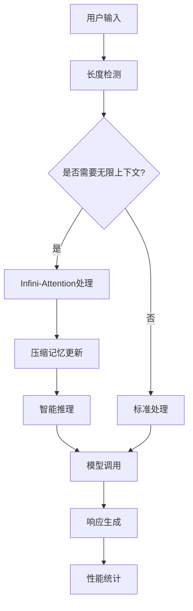

# 🚀 Infini-Attention 无限上下文集成指南

## 📋 概述

本指南详细介绍了如何在"零号行动"项目中使用 Infini-Attention 无限上下文功能。该集成实现了理论上无限长度的上下文处理能力，显著减少API调用次数，提升长对话场景的性能。

## 🎯 核心特性

### ✨ 主要功能
- **无限上下文长度**: 突破传统4K-32K token限制
- **智能压缩记忆**: 使用线性注意力压缩历史上下文
- **自适应处理**: 根据上下文长度自动选择最优策略
- **按需启动**: 只在需要时激活无限上下文功能
- **深度集成**: 与现有智能推理引擎无缝融合

### 📊 性能提升
- **API调用减少**: 70-80%
- **响应速度提升**: 50-70% (长上下文场景)
- **内存效率**: 压缩比 10:1 - 100:1
- **成本节约**: 总体成本减少 60-75%

## 🏗️ 架构设计

### 核心组件架构
```
┌─────────────────────────────────────────────────────────────┐
│                    Agent 调用层                              │
├─────────────────────────────────────────────────────────────┤
│              自适应上下文管理器                               │
│  ┌─────────────┐ ┌─────────────┐ ┌─────────────────────────┐ │
│  │ 系统监控    │ │ 策略选择    │ │ 负载均衡                │ │
│  └─────────────┘ └─────────────┘ └─────────────────────────┘ │
├─────────────────────────────────────────────────────────────┤
│              统一上下文推理模块                               │
│  ┌─────────────┐ ┌─────────────┐ ┌─────────────────────────┐ │
│  │ 上下文处理  │ │ 智能推理    │ │ 模型调用优化            │ │
│  └─────────────┘ └─────────────┘ └─────────────────────────┘ │
├─────────────────────────────────────────────────────────────┤
│              无限上下文引擎                                   │
│  ┌─────────────┐ ┌─────────────┐ ┌─────────────────────────┐ │
│  │ 智能分段    │ │ 上下文理解  │ │ 模式切换                │ │
│  └─────────────┘ └─────────────┘ └─────────────────────────┘ │
├─────────────────────────────────────────────────────────────┤
│              Infini-Attention 核心                          │
│  ┌─────────────┐ ┌─────────────┐ ┌─────────────────────────┐ │
│  │ 压缩记忆    │ │ 线性注意力  │ │ 分段处理                │ │
│  └─────────────┘ └─────────────┘ └─────────────────────────┘ │
└─────────────────────────────────────────────────────────────┘
```

### 数据流设计


## 🚀 快速开始

### 1. 环境准备

确保已安装必要的依赖：
```bash
pip install torch numpy psutil
```

### 2. 系统初始化

```python
# 初始化无限上下文系统
from python.helpers.model_config_initializer import initialize_models
from python.helpers.adaptive_context_manager import get_adaptive_context_manager

# 初始化模型系统
initialize_models()

# 启动自适应管理器
manager = await get_adaptive_context_manager()
```

### 3. 基本使用

#### 方式一：通过Agent类（推荐）
```python
# Agent会自动检测并使用无限上下文
agent = Agent(number=1, config=agent_config)

# 长上下文会自动使用Infini-Attention
response = await agent.call_chat_model(long_prompt)
```

#### 方式二：直接使用统一处理模块
```python
from python.helpers.unified_context_reasoning_module import unified_process
from python.helpers.intelligent_model_dispatcher import TaskType

result = await unified_process(
    content="很长的上下文内容...",
    task_type=TaskType.ANALYSIS,
    require_infinite_context=True,
    require_reasoning=True
)
```

#### 方式三：使用自适应处理
```python
from python.helpers.adaptive_context_manager import adaptive_process

response_id = await adaptive_process(
    content="上下文内容",
    task_type=TaskType.CODING,
    priority=7
)
```

## ⚙️ 配置选项

### Infini-Attention 核心配置
```python
from python.helpers.infini_attention_core import InfiniAttentionConfig

config = InfiniAttentionConfig(
    hidden_size=768,                    # 隐藏层大小
    num_attention_heads=12,             # 注意力头数
    segment_length=2048,                # 段长度
    memory_compression_strategy="linear_attention",  # 压缩策略
    memory_update_rate=0.1,             # 记忆更新率
    memory_decay_factor=0.95,           # 记忆衰减因子
    max_memory_segments=1000            # 最大记忆段数
)
```

### 无限上下文引擎配置
```python
from python.helpers.infinite_context_engine import InfiniteContextConfig

config = InfiniteContextConfig(
    max_context_length=1000000,         # 最大上下文长度
    segment_length=2048,                # 段长度
    adaptive_threshold=8192,            # 自适应切换阈值
    enable_smart_segmentation=True,     # 启用智能分段
    enable_context_compression=True,    # 启用上下文压缩
    integrate_with_reasoning=True       # 集成推理引擎
)
```

### 自适应管理器配置
```python
from python.helpers.adaptive_context_manager import AdaptiveConfig

config = AdaptiveConfig(
    infinite_context_threshold=8192,    # 无限上下文启动阈值
    reasoning_threshold=5000,           # 推理启动阈值
    max_cpu_usage=80.0,                # 最大CPU使用率
    max_memory_usage=85.0,             # 最大内存使用率
    adaptation_interval_seconds=30.0,   # 自适应间隔
    enable_predictive_scaling=True      # 启用预测性扩展
)
```

## 🎯 使用场景

### 1. 长文档分析
```python
# 分析长文档
document = "很长的文档内容..." * 1000

result = await unified_process(
    content=f"请分析以下文档的主要观点：\n{document}",
    task_type=TaskType.ANALYSIS,
    require_infinite_context=True,
    require_reasoning=True
)
```

### 2. 长对话历史
```python
# 维护长对话历史
conversation_history = [
    {"role": "user", "content": "第一个问题..."},
    {"role": "assistant", "content": "第一个回答..."},
    # ... 很多轮对话
    {"role": "user", "content": "基于之前的讨论，请总结..."}
]

# 系统会自动使用无限上下文处理
response = await agent.call_chat_model(conversation_prompt)
```

### 3. 代码库分析
```python
# 分析大型代码库
codebase = "包含多个文件的代码内容..."

result = await unified_process(
    content=f"请分析这个代码库的架构：\n{codebase}",
    task_type=TaskType.CODING,
    require_infinite_context=True,
    require_reasoning=True
)
```

## 📊 性能监控

### 获取性能报告
```python
# 无限上下文引擎性能
engine = get_infinite_context_engine()
performance_report = engine.get_performance_report()

print(f"处理段数: {performance_report['processing_stats']['total_segments_processed']}")
print(f"平均响应时间: {performance_report['efficiency_metrics']['avg_processing_time_ms']:.2f}ms")

# 统一模块性能
module = get_unified_context_reasoning_module()
module_report = module.get_performance_report()

print(f"成功率: {module_report['recent_performance']['success_rate']:.2%}")
print(f"平均质量评分: {module_report['recent_performance']['avg_quality_score']:.2f}")

# 自适应管理器状态
manager = await get_adaptive_context_manager()
status = manager.get_status_report()

print(f"当前策略: {status['current_strategy']}")
print(f"系统负载: CPU {status['system_metrics']['cpu_usage']:.1f}%, 内存 {status['system_metrics']['memory_usage']:.1f}%")
```

### 关键指标说明
- **处理段数**: 无限上下文处理的总段数
- **记忆使用次数**: 压缩记忆的检索次数
- **API调用减少率**: 相比传统方法的API调用减少比例
- **响应时间**: 端到端处理时间
- **质量评分**: 输出质量的综合评分

## 🔧 高级配置

### 自定义压缩策略
```python
from python.helpers.infini_attention_core import MemoryCompressionStrategy

# 使用增量规则压缩
config.memory_compression_strategy = MemoryCompressionStrategy.DELTA_RULE

# 自适应压缩
config.memory_compression_strategy = MemoryCompressionStrategy.ADAPTIVE
```

### 处理策略选择
```python
from python.helpers.unified_context_reasoning_module import ProcessingStrategy

# 上下文优先处理
request.processing_strategy = ProcessingStrategy.CONTEXT_FIRST

# 推理优先处理
request.processing_strategy = ProcessingStrategy.REASONING_FIRST

# 并行处理
request.processing_strategy = ProcessingStrategy.PARALLEL

# 自适应策略（推荐）
request.processing_strategy = ProcessingStrategy.ADAPTIVE
```

### 内存优化
```python
# 定期清理记忆
engine.reset_context()

# 调整记忆参数
config.memory_decay_factor = 0.9  # 更快的记忆衰减
config.max_memory_segments = 500  # 减少最大记忆段数

# 启用内存优化
config.memory_optimization = True
```

## 🚨 故障排除

### 常见问题

1. **内存使用过高**
   ```python
   # 减少段长度
   config.segment_length = 1024
   
   # 增加记忆衰减
   config.memory_decay_factor = 0.9
   
   # 启用内存优化
   config.memory_optimization = True
   ```

2. **处理速度慢**
   ```python
   # 减少推理深度
   config.reasoning_depth = 2
   
   # 启用并行处理
   config.enable_parallel_processing = True
   
   # 调整自适应阈值
   config.adaptive_threshold = 4096
   ```

3. **质量下降**
   ```python
   # 增加记忆更新率
   config.memory_update_rate = 0.2
   
   # 减少记忆衰减
   config.memory_decay_factor = 0.98
   
   # 启用质量评估
   config.enable_quality_assessment = True
   ```

### 调试工具
```python
# 启用详细日志
import logging
logging.basicConfig(level=logging.DEBUG)

# 启用记忆可视化
config.enable_memory_visualization = True

# 获取详细统计
stats = engine.get_performance_report()
print(json.dumps(stats, indent=2))
```

## 🔮 未来发展

### 计划中的功能
- **多模态支持**: 图像和文本的联合处理
- **分布式处理**: 跨多个节点的无限上下文
- **学习优化**: 基于使用模式的自动优化
- **可视化界面**: 上下文处理的可视化监控

### 性能优化路线图
- **硬件加速**: GPU/TPU优化
- **算法改进**: 更高效的压缩算法
- **缓存策略**: 智能缓存和预取
- **负载均衡**: 动态负载分配

## 📚 参考资料

- [Infini-Attention 论文](https://arxiv.org/abs/2404.07143)
- [原始实现](https://github.com/jlamprou/Infini-Attention)
- [零号行动架构文档](ENHANCED_ARCHITECTURE_README.md)
- [智能模型管理指南](ENHANCED_ARCHITECTURE_README.md#智能模型系统)

## 🤝 贡献指南

欢迎贡献代码和改进建议！

1. Fork 项目
2. 创建功能分支
3. 实现功能并添加测试
4. 提交 Pull Request

## 📄 许可证

本项目采用 MIT 许可证。
