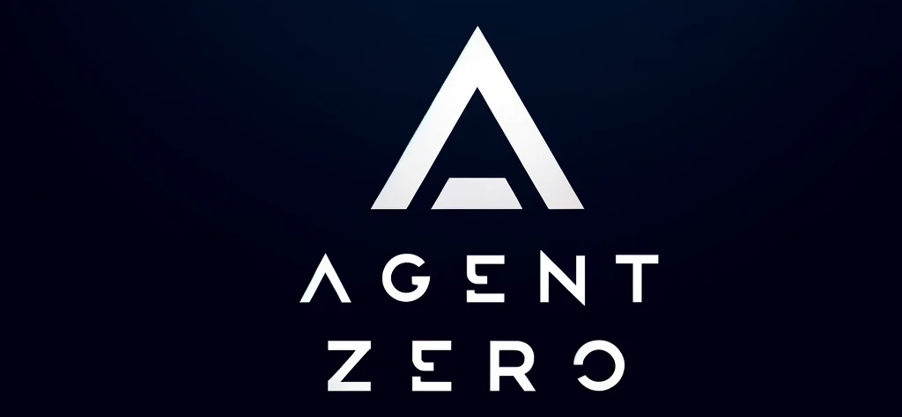

# Agent Zero
**Personal and organic AI framework**
- Agent Zero is not a predefined agentic framework. It is designed to be dynamic, organically growing, and learning as you use it.
- Agent Zero is fully transparent, readable, comprehensible, and interactive.
- Agent Zero uses the computer as a tool to accomplish its tasks.

## Key concepts
1. **General-purpose assistant**
- Agent Zero is not pre-programmed for specific tasks (but can be). It is meant to be a general-purpose personal assistant. Give it a task, and it will gather information, execute commands and code, cooperate with other instances, and do its best to accomplish it.
- It has a persistent memory, allowing it to memorize previous solutions, code, facts, instructions, etc., to solve tasks faster and more reliably in the future.

2. **Computer as a tool**
- Agent Zero uses the operating system as a tool to accomplish its tasks. It has no single-purpose tools pre-programmed. Instead, it can write its own code and use the terminal to create and use its own tools as needed.
- The only default tools in its arsenal are online search, memory features, communication (with the user and other agents), and code/terminal execution. Everything else is created by the agent itself or can be extended by the user.
- Tool usage functionality has been developed from scratch to be the most compatible and reliable, even with very small models.

3. **Multi-agent cooperation**
- Every agent has a superior agent giving it tasks and instructions. Every agent then reports back to its superior.
- In the case of the first agent, the superior is the human user; the agent sees no difference.
- Every agent can create its subordinate agent to help break down and solve subtasks. This helps all agents keep their context clean and focused.

4. **Completely customizable and extensible**
- Almost nothing in this framework is hard-coded. Nothing is hidden. Everything can be extended or changed by the user.
- The whole behavior is defined by a system prompt in the **prompts/agent.system.md** file. Change this prompt and change the framework dramatically.
- The framework does not guide or limit the agent in any way. There are no hard-coded rails that agents have to follow.
- Every prompt, every small message template sent to the agent in its communication loop, can be found in the **prompts/** folder and changed.
- Every default tool can be found in the **tools/** folder and changed or copied to create new predefined tools.
- Of course, it is open-source (except for some tools like Perplexity, but that will be replaced with an open-source alternative as well in the future).

5. **Communication is key**
- Give your agent a proper system prompt and instructions, and it can do miracles.
- Agents can communicate with their superiors and subordinates, asking questions, giving instructions, and providing guidance. Instruct your agents in the system prompt on how to communicate effectively.
- The terminal interface is real-time streamed and interactive. You can stop and intervene at any point. If you see your agent heading in the wrong direction, just stop and tell it right away.
- There is a lot of freedom in this framework. You can instruct your agents to regularly report back to superiors asking for permission to continue. You can instruct them to use point-scoring systems when deciding when to delegate subtasks. Superiors can double-check subordinates' results and dispute. The possibilities are endless.

## Nice features to have
- Output is very clean, colorful, and readable; nothing is hidden.
- The same colorful output you see in the terminal is automatically saved to HTML file in **logs/** folder for every session.
- Agent output is streamed in real-time, allowing the user to read along and intervene at any time.
- No coding is required, only prompting and communication skills.
- With a solid system prompt, the framework is reliable even with small models, including precise tool usage.

## Keep in mind
1. **Agent Zero can be dangerous!**
With proper instruction, Agent Zero is capable of many things, even potentially dangerous to your computer, data, or accounts. Always run Agent Zero in an isolated environment, preferably in a Linux virtual machine with backup.

2. **Agent Zero is not pre-programmed; it is prompt-based.**
The whole framework contains only a minimal amount of code and does not guide the agent in any way.
Everything lies in the system prompt in the **prompts/** folder. Here you can rewrite the whole framework behavior to your needs.
If your agent fails to communicate properly, use tools, reason, use memory, find answers - just instruct it better.

3. **If you cannot provide the ideal environment, let your agent know.**
Agent Zero is made to be used in an isolated virtual machine (for safety) with some tools preinstalled and configured.
If you cannot provide all the necessary conditions or API keys, just change the system prompt and tell your agent what operating system and tools are at its disposal. Nothing is hard-coded; if you do not tell your agent about a certain tool, it will not know about it and will not try to use it.

## Known problems
1. The system prompt sucks. You can do better. If you do, help me please :)
2. Input freeze on some Linux terminals - for some reason, sometimes the input field freezes on some terminal apps on linux when the window loses focus. Right now I have no clue why...
3. Claude models like to hallucinate when using tools. This can probebly be fixed in prompt, but for some reason, Claude models like to use multiple tools in a single message and not wait for output, they just make up their outputs right away. For now I have limited the tool usage to 1 tool per message, this helps a little.

## Ideal environment
- **Linux VM / docker container**: The perfect environment to run Agent Zero is a Debian-based Linux virtual machine or docker container with enhanced privileges or root access (to install packages and run terminal commands).
- **Python**: Python has to be installed on the system to run the framework and let the agent execute created Python scripts.
- **NodeJS**: NodeJS is required to allow the agent to run JS scripts as well.
- **Internet access**: The agent will need internet access to use its online knowledge tool and execute commands and scripts requiring a connection. If you do not need your agent to be online, you can alter its prompts in the **prompts/** folder and make it fully local.

## Setup
1. **Required API keys:**
- At the moment, the only required API key is for https://www.perplexity.ai/ API. Perplexity is used as a convenient web search tool and has not yet been replaced by an open-source alternative.
- Chat models and embedding models can be executed locally via Ollama and HuggingFace or via API as well.

2. **Enter your API keys:**
- You can enter your API keys into the **.env** file, which you can copy from **example.env**
- Or you can export your API keys in the terminal session:
~~~bash
export API_KEY_PERPLEXITY="your-api-key-here"
export API_KEY_OPENAI="your-api-key-here"
~~~

3. **Install dependencies with the following terminal command:**
~~~bash
pip install -r requirements.txt
~~~

3. **Choose your chat and embeddings model:**
- In the **main.py** file, right at the start of the **chat()** function, you can see how the chat model and embedding model are set.
- You can choose between online models (OpenAI, Anthropic, Groq) or offline (Ollama, HuggingFace) for both.

## Run the program
- Just run the **main.py** file in Python:
~~~bash
python main.py
~~~

- Right now, only the interactive terminal interface is available; in the future, a web interface will probably be implemented.
