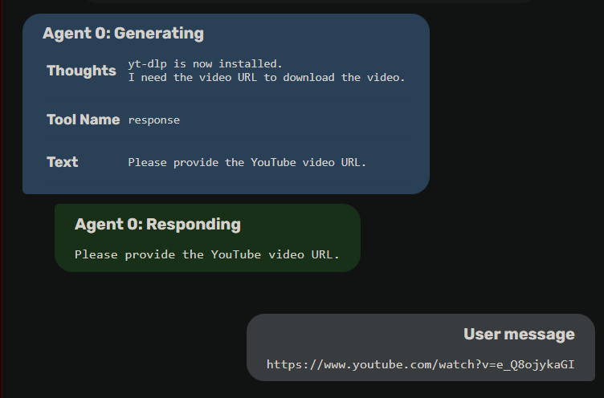

# Quick Start
This guide provides a quick introduction to using Agent Zero. We'll cover launching the web UI, starting a new chat, and running a simple task.

## Launching the Web UI
1. Make sure you have Agent Zero installed and your environment set up correctly (refer to the [Installation guide](2_installation.md) if needed).
2. Open a terminal in the Agent Zero directory and activate your conda environment (if you're using one).
3. Run the following command:

```bash
python run_ui.py
```

4.  A message similar to this will appear in your terminal, indicating the Web UI is running:

```
* Serving Flask app 'app'
* Debug mode: off
WARNING: This is a development server. Do not use it in a production deployment. 
Use a production WSGI server instead.
* Running on http://127.0.0.1:50001
Press CTRL+C to quit
```

5. Open your web browser and navigate to the URL shown in the terminal (usually `http://127.0.0.1:50001`). You should see the Agent Zero Web UI.

## Running a Simple Task
Let's ask Agent Zero to tell us the current time.  Here's how:

1.  Type "Download a YouTube video for me" in the chat input field and press Enter or click the send button.

2. Agent Zero will process your request.  You'll see its "thoughts" and the actions it takes displayed in the UI. It will find a default already existing solution, that implies using the `code_execution_tool` to run a simple Python script to perform the task.

3. The agent will then ask you for the URL of the YouTube video you want to download.

## Example Interaction
Here's an example of what you might see in the Web UI at step 3:


## Next Steps
Now that you've run a simple task, you can experiment with more complex requests. Try asking Agent Zero to:

* Perform calculations
* Search the web for information
* Execute shell commands
* Explore web development tasks
* Create or modify files

The Usage Guide provides more in-depth information on using Agent Zero's various features, including prompt engineering, tool usage, and multi-agent cooperation.