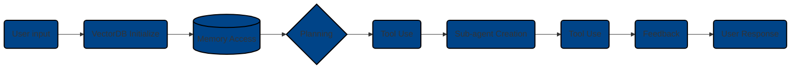

# Architecture Overview
Agent Zero is built on a flexible and modular architecture designed for extensibility and customization. This document outlines the key components and their interactions. This simplified diagram illustrates the hierarchical relationship between agents and their interaction with tools, prompts, memory, knowledge base and instruments. 

```mermaid
graph LR;    
    User(((User))) <==> AgentZero(Agent 0);
    Data2[(
    Memory,
    Knowledge,
    Instruments,
    Prompts,
    Extensions
    )]    
    AgentZero <==> SubAgent1(Subordinate 
    Agent 1);
    SubAgent1 <==> SubAgent2(Subordinate 
    Agent 2);
    AgentZero <==> SubAgent2
    AgentZero <--> Tools{Tools};
    SubAgent1 <--> Tools;
    SubAgent2 <--> Tools;
    Tools -.- CodeExec;
    subgraph "Docker Container"
    direction TB
        CodeExec[Code Execution Tool] <--> WorkDir[Work Directory
        work_dir];
    end
    Data2 --> AgentZero;
    Data2 --> SubAgent1;
    Data2 --> SubAgent2;
    classDef bk fill:#048,stroke:#000,stroke-width:2px;
    class User,AgentZero,SubAgent1,SubAgent2 bk;
    classDef grey fill:#333,stroke:#555,stroke-width:2px;
    class Data,Tools,CodeExec,WorkDir grey;
```



The user or Agent 0 is at the top of the hierarchy, delegating tasks to subordinate agents, which can further delegate to other agents.  Each agent can utilize tools and access the shared assets (prompts, memory, knowledge, extensions and instruments) to perform its tasks.

## Core Components
Agent Zero's architecture revolves around the following key components:

1. **Agents:** The core actors within the framework. Agents receive instructions, reason, make decisions, and utilize tools to achieve their objectives. Agents operate within a hierarchical structure, with superior agents delegating tasks to subordinate agents.

2. **Tools:** Tools are functionalities that agents can leverage. These can include anything from web search and code execution to interacting with APIs or controlling external software. Agent Zero provides a mechanism for defining and integrating both built-in and custom tools.

3. **Memory:** Agents have persistent memory that stores past experiences, knowledge, and information. This memory is used to inform decision-making and improve performance over time.

4. **Prompts:** Prompts guide agent behavior and communication. The system prompt defines the agent's overall role and objectives, while message prompts structure the interaction and flow of information between agents and tools.

5. **Knowledge:** Knowledge refers to the user-provided information and data that agents can leverage. This can include documents, databases, or any other relevant resources. Agents can retrieve and utilize this knowledge to answer questions, make decisions, and perform RAG-augmented tasks.

6. **Instruments:** Instruments provide a way to add custom functionalities to Agent Zero. They can modify agent behavior introducing new procedures, call for tools, or scripts to integrate with other systems. Instruments scripts are run inside the Docker container.

7. **Extensions:** Extensions are custom components that can be added to Agent Zero to enhance its capabilities. Extensions can include new message loops, custom memory management rules, or even more.

8. **Docker Container:** Agent Zero execute code commands in a Docker container, which provides isolation and security. This ensures that agents can safely and securely interact with tools and external systems.

## Agent Hierarchy and Communication
Agent Zero employs a hierarchical agent structure, where a top-level agent (often the user) can delegate tasks to subordinate agents. This hierarchy allows for the efficient breakdown of complex tasks into smaller, more manageable sub-tasks.

Communication flows between agents through messages, which are structured according to the prompt templates.  These messages typically include:

| Argument | Description |
| --- | --- |
| `Thoughts:` | The agent's internal reasoning and planning process. |
| `Tool name:` | The specific tool used by the agent. |
| `Responses or queries:` | Results, feedback or queries from tools or other agents. |

## Interaction Flow
A typical interaction flow within Agent Zero might look like this:



1.  The user provides an instruction to Agent 0.
2.  Agent 0 initializes VectorDB and access memory as needed.
3.  Agent 0 analyzes the instruction and formulates a plan using `thoughts` argument, possibly involving the use of tools or the creation of sub-agents.
4.  If necessary, Agent 0 delegates sub-tasks to subordinate agents.
5.  Agents use tools to perform actions, both providing arguments and responses or queries.
6.  Agents communicate results and feedback back up the hierarchy.
7.  Agent 0 provides the final response to the user.

## Memory System
The memory system is a critical component of Agent Zero, enabling the agent to learn and adapt from past interactions. It operates on a hybrid model where part of the memory is managed automatically by the framework while users can also manually input and extract information.
- **Memory Loading**: At the start of each session, relevant memories are automatically loaded and injected into the system prompt, allowing the agent to utilize past interactions effectively.
- **Memory Structure**: The memory is categorized into four distinct areas:
  - **Storage and retrieval** of user-provided information (e.g., names, API keys).
  - **Fragments**: Contains pieces of information from previous conversations, updated automatically.
  - **Solutions**: Stores successful solutions from past interactions for future reference.
  - **Metadata**: Each memory entry includes metadata (IDs, timestamps), enabling efficient filtering and searching based on specific criteria.

## Knowledge

- **Knowledge Base:** Place your knowledge files (`.txt`, `.pdf`, `.csv`, `.html`, `.json`, `.md`) directly inside `/knowledge/custom/main`. Agent Zero will automatically import them. The list of supported file formats is yet to be expanded.

## Prompts

The `prompts` directory contains various Markdown files that control agent behavior and communication. The most important file is `agent.system.main.md`, which acts as a central hub, referencing other prompt files.  

**Key Prompt Files:**
| Prompt File | Description |
|---|---|
| agent.system.main.role.md | Defines the agent's overall role. |
| agent.system.main.communication.md | Specifies how the agent should communicate. |
| agent.system.main.solving.md | Describes the agent's approach to problem-solving. |
| agent.system.main.tips.md | Provides additional tips or guidance to the agent. |
| agent.system.tools.md | Organizes and calls the individual tool prompt files. |
| agent.system.tool.*.md | Individual tool prompt files (with * as the tool name). |

You can customize any of these files.  Agent Zero will use the files in your custom `prompts_subdir` if they exist, otherwise, it will fall back to the files in `prompts/default`.

## Extensions

- Extensions are a powerful feature of Agent Zero, designed to keep the main codebase clean and organized while allowing for greater flexibility and modularity. Here’s a detailed exploration of the extensions feature:
- The extensions framework allows users to create modular components that can be integrated into the main system.
### Structure of Extensions
Extensions can be found in `python/extensions` directory.
- **Folder Organization**: The extensions are stored in a designated subfolder within the Python directory. This includes various subfolders that correspond to different aspects of the agent's message loop.
- **Execution Order**: Files within these subfolders are executed in alphabetical order, ensuring predictable behavior when multiple extensions are utilized.
### Types of Default Extensions
- **Message Loop Prompts**: These extensions handle the construction of system messages and maintain message history, ensuring that the agent has access to relevant context during interactions.
- **Memory Management**: Extensions can also manage memory recall and solution memorization, allowing for dynamic updates based on user interactions.
- **Custom Extensions**: Users can create custom extensions to add new functionalities or modify existing ones (Adding Extensions section to be added soon).

## Key Files
| File | Description |
| --- | --- |
| `agent.py` | Contains the core logic for the `AgentConfig` class, which defines the `prompts_subdir`, rate limits for models, and mechanisms for tweaking SSH and Docker connections. |
| `example.env` | Contains environment variables for configuring API keys and other settings of Agent Zero. |
| `initialize.py` | Defines Agent Zero's core configuration, including model choices and other critical settings. This is the central point for customizing the framework's behavior. See [Choosing Your LLMs](installation.md#choosing-your-llms) for more details. |
| `models.py` | Defines the `get_provider_chat` or `..._embedding` functions, which specifies the model provider, model name, and other parameters for adding support for new models or custom models. |
| `requirements.txt` | Lists the dependencies used by pip to install the necessary packages when you setup Agent Zero. |
| `run_cli.py` | Starts the Agent Zero CLI. |
| `run_ui.py` | Starts the Agent Zero Web UI. |

## Directory Structure
| Directory | Description |
| --- | --- |
| `docker/` | Dockerfiles and related files for building Docker image |
| `docs/` | Quickstart and installation guide |
| `instruments/` | Instruments for interacting with the environment |
| `knowledge/` | Knowledge base for storing and retrieving information |
| `logs/` | HTML chat log files |
| `memory/` | Memory storage for storing and retrieving information |
| `prompts/` | System and tools prompts folders |
| `python/` | Python code for the main system and tools |
| `python/extensions/` | Extensions for the main system |
| `tests/` | Unit tests for the project |
| `tmp/` | Temporary files |
| `webui/` | Web UI |
| `work_dir/` | Working directory for the Agent |

# Customization
Agent Zero's strength lies in its flexibility. This section details how to customize various aspects of the framework, tailoring it to your specific needs and preferences.

## Custom Prompts
### Changing the System Prompt Folder
1. Create a new directory inside the `prompts` directory (e.g., `prompts/my-custom-prompts`).
2. When copying the contents of the `prompts/default` directory into your new directory, take into account that Agent Zero will merge the contents of the `default` directory with the contents of your custom directory. This means that you can copy only the files you want to modify, and the rest will be taken from the `default` directory.
3. Modify the prompts in your custom directory as needed.
4. In `initialize.py`, update the `prompts_subdir` parameter in `AgentConfig` to point to your custom directory:
   ```python
   config = AgentConfig(..., prompts_subdir="my-custom-prompts", ...)
   ```

## AgentConfig
The `AgentConfig` class in `initialize.py` provides further customization options:

- `prompts_subdir`: Specifies the directory containing your custom prompts.  This allows you to create and manage different sets of prompts for different use cases.  (See *Prompt Customization* below).

- `knowledge_subdirs`: Defines the directories where Agent Zero searches for knowledge files.

- **Rate Limiting:** Control API usage and prevent rate limit errors by setting `rate_limit_seconds` and `rate_limit_requests`.

- **Docker and SSH:** Configure Docker and SSH settings for code execution, if needed.

## Adding Tools
While good prompting can often achieve the desired behavior, sometimes custom tools are necessary.

1. Create a new file named `agent.system.tool.$TOOL_NAME.md` inside your `prompts/$SUBDIR` directory. This file will contain the prompt for your custom tool.
2. Open `agent.system.tools.md` and add a reference to your new tool prompt.
3. If your tool requires specific code or external API calls, create a Python file for it in the `python/tools` directory, implementing the `Tool` base class.

## Adding Instruments
Instruments allow you to add predefined actions or workflows to Agent Zero without adding to the token count of the system prompt.

1. Create a new folder with the name of your instrument (without spaces) inside `instruments/custom`.
2. Inside this folder, create a `.md` file with the description of the instrument and a `.sh` script (or other executable) with the actual implementation. The `.md` file acts as the interface for the Agent to interact with the Instrument, and the agent will call the `.sh` with the given user arguments. The agent will parse the `.md` file, using the Instrument's name, description, and arguments described in it.
3. The agent will automatically detect and use your custom instruments.
