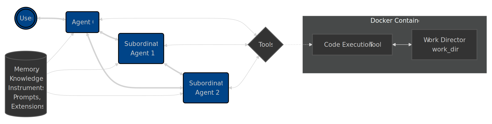

# Architecture Overview
Agent Zero is built on a flexible and modular architecture designed for extensibility and customization. This section outlines the key components and the interactions between them. This simplified diagram illustrates the hierarchical relationship between agents and their interaction with tools, extensions, instruments, prompts, memory and knowledge base.



The user or Agent 0 is at the top of the hierarchy, delegating tasks to subordinate agents, which can further delegate to other agents.  Each agent can utilize tools and access the shared assets (prompts, memory, knowledge, extensions and instruments) to perform its tasks.

## Core Components
Agent Zero's architecture revolves around the following key components:

1. **Agents:** The core actors within the framework. Agents receive instructions, reason, make decisions, and utilize tools to achieve their objectives. Agents operate within a hierarchical structure, with superior agents delegating tasks to subordinate agents.

2. **Tools:** Tools are functionalities that agents can leverage. These can include anything from web search and code execution to interacting with APIs or controlling external software. Agent Zero provides a mechanism for defining and integrating both built-in and custom tools.

3. **Memory:** Agent Zero has persistent, long-term memory to store past experiences, knowledge, and information. This memory is used to inform decision-making and improve performance over time. Learn more in [Memory System](#memory-system)

4. **Prompts:** Guide agent's behavior and communication. The system and tools prompts defines the agent's overall role and objectives, while message prompts structure the interaction and flow of information and memory.

5. **Knowledge:** Refers to the user-provided information and data that agents can leverage. This can include documents, databases, or any other relevant resources. Agents can retrieve and utilize this knowledge to answer questions, make decisions, and perform RAG-augmented tasks.

6. **Instruments:** Instruments provide a way to add custom functionalities to Agent Zero. They can modify agent behavior introducing new procedures, function calls, or scripts to integrate with other systems. Instruments scripts are run inside the Docker Container.

7. **Extensions:** Extensions are logical components that can be added to Agent Zero to enhance its capabilities. Extensions can include new message loops, custom memory management rules, or even more.

8. **Docker Container:** Agent Zero execute code commands in a Docker container, which provides isolation and security. This ensures that agents can safely and securely interact with tools, especially when running code.

## Agent Hierarchy and Communication
Agent Zero employs a hierarchical agent structure, where a top-level agent (often the user) can delegate tasks to subordinate agents. This hierarchy allows for the efficient breakdown of complex tasks into smaller, more manageable sub-tasks.

Communication flows between agents through messages, which are structured according to the prompt templates.  These messages typically include:

| Argument | Description |
| --- | --- |
| `Thoughts:` | The agent's Chain of Thought and planning process. |
| `Tool name:` | The specific tool used by the agent. |
| `Responses or queries:` | Results, feedback or queries from tools or other agents. |

## Interaction Flow
A typical interaction flow within Agent Zero might look like this:


1.  The user provides an instruction to Agent 0.
2.  Agent 0 initializes VectorDB and access memory.
3.  Agent 0 analyzes the instruction and formulates a plan using `thoughts` argument, possibly involving the use of tools or the creation of sub-agents.
4.  If necessary, Agent 0 delegates sub-tasks to subordinate agents.
5.  Agents use tools to perform actions, both providing arguments and responses or queries.
6.  Agents communicate results and feedback back up the hierarchy.
7.  Agent 0 provides the final response to the user.

## Memory System
The memory system is a critical component of Agent Zero, enabling the agent to learn and adapt from past interactions. It operates on a hybrid model where part of the memory is managed automatically by the framework while users can also manually input and extract information.
- **Memory Loading**: At the start of each session, relevant memories are automatically loaded and injected into the system prompt, allowing the agent to utilize past interactions effectively.
- **Memory Structure**: The memory is categorized into four distinct areas:
  - **Storage and retrieval** of user-provided information (e.g., names, API keys).
  - **Fragments**: Contains pieces of information from previous conversations, updated automatically.
  - **Solutions**: Stores successful solutions from past interactions for future reference.
  - **Metadata**: Each memory entry includes metadata (IDs, timestamps), enabling efficient filtering and searching based on specific criteria.

## Tools
**Built-in Tools:** Agent Zero comes with a set of built-in tools, including web search and code execution. These tools are general-purpose and designed to help agents perform tasks efficiently:

| Tool | Function |
| --- | --- |
| call_subordinate | Allows agents to delegate tasks to subordinate agents. |
| code_execution_tool | Allows agents to execute Python, Node.js, and Shell code in the terminal of the Docker container. |
| knowledge_tool | Enables agents to retrieve information from memory,  knowledge base or online external sources. |
| response_tool | Allows agents to output a response. |
| memory_tool | Enables agents to save, load, delete and forget information from memory. |
| webpage_content_tool | Enables agents to fetch and analyze the text content of webpages. |

- **Knowledge Tool:** The `knowledge_tool` uses DuckDuckGo and Perplexity APIs to search the web and retrieve information. It can also search the local knowledge base and memory for relevant information. The tool returns a summary of the information, which can be used by the agent to make decisions or answer questions.

> [!TIP]
> The Perplexity API key is the only service recommended for a full experience of 
> Agent Zero, but you can use DuckDuckGo by leaving the Perplexity API key value 
> empty. DuckDuckGo usage in Agent Zero is free of charge but has its rate limits.
  
> [!NOTE]  
> It's important to note that the DuckDuckGo API is not as powerful as Perplexity 
> and may not return accurate or relevant results for some queries. The Perplexity 
> API is yet to be replaced with an open-source alternative.

- **Custom Tools:** Users can create custom tools to extend Agent Zero's capabilities. Custom tools can be integrated into the framework by defining a tool specification, which includes the tool's prompt to be placed in `/prompts/$FOLDERNAME/agent.system.tool.$TOOLNAME.md`, as further detailed [here](#adding-tools).

- **Tools vs. Instruments:** Tools are always present in system prompt, so you should keep them to minimum. To save yourself some tokens, use the [Instruments module](#adding-instruments) to call custom scripts or functions.

## Instruments
- **Instruments:** Instruments allows you to add predefined actions or workflows to Agent Zero without adding to the token count of the system prompt. You can have unlimited amount of instruments, they are stored in long-term memory of Agent Zero, and recalled when needed. To create Instruments, see [Adding Instruments](#adding-instruments).

## Knowledge
- **Custom Knowledge:** Users can add custom knowledge files to the `/knowledge/custom/main` directory. Agent Zero will automatically import these files, expanding its knowledge base. Supported file formats include `.txt`, `.pdf`, `.csv`, `.html`, `.json`, and `.md`. The list of supported file formats is yet to be expanded.
- **Knowledge Base:** PDFs, databases, books, code documentation, and other documents can be added to the knowledge base. Agent Zero uses this information to answer questions and make decisions. The `/docs` folder, containing Agent Zero's documentation stack, is automatically added to the knowledge base.

## Prompts
The `prompts` directory contains various Markdown files that control agent behavior and communication. The most important file is `agent.system.main.md`, which acts as a central hub, referencing other prompt files.  

**Key Prompt Files:**
| Prompt File | Description |
|---|---|
| agent.system.main.role.md | Defines the agent's overall role. |
| agent.system.main.communication.md | Specifies how the agent should communicate. |
| agent.system.main.solving.md | Describes the agent's approach to tasks. |
| agent.system.main.tips.md | Provides additional tips or guidance to the agent. |
| agent.system.tools.md | Organizes and calls the individual tool prompt files. |
| agent.system.tool.*.md | Individual tool prompt files (with * as the tool name). |

> [!NOTE]  
> You can customize any of these files.  Agent Zero will use the files in your custom `prompts_subdir` 
> if they exist, otherwise, it will fall back to the files in `prompts/default`.

## Extensions
- Extensions are a powerful feature of Agent Zero, designed to keep the main codebase clean and organized while allowing for greater flexibility and modularity. Here’s a detailed exploration of the extensions feature:
### Structure of Extensions
Extensions can be found in `python/extensions` directory.
- **Folder Organization**: The extensions are stored in a designated subfolder within the Python directory. This includes various subfolders that correspond to different aspects of the agent's message loop.
- **Execution Order**: Files within these subfolders are executed in alphabetical order, ensuring predictable behavior when multiple extensions are utilized.
### Types of Default Extensions
- **Message Loop Prompts**: These extensions handle the construction of system messages and maintain message history, ensuring that the agent has access to relevant context during interactions.
- **Memory Management**: Extensions can also manage memory recall and solution memorization, allowing for dynamic updates based on user interactions.
- **Custom Extensions**: Users can create custom extensions to add new functionalities or modify existing ones. See [Adding Extensions](#adding-extensions) for more details.

## Key Files
| File | Description |
| --- | --- |
| `agent.py` | Contains the core logic for the `Agent`, `AgentConfig`, and messages classes, which defines the `prompts_subdir`, rate limits for models, and more, though `AgentConfig` class must be edited through `initialize.py` file. |
| `example.env` | Contains environment variables for configuring API keys and other settings of Agent Zero. See more in [Installation](installation.md#5-configure-agent-zero) |
| `initialize.py` | Defines Agent Zero's core configuration, including model choices and other critical settings. This is the central point for customizing the framework's behavior. See [Choosing Your LLMs](installation.md#choosing-your-llms) for more details. |
| `models.py` | Defines the `get_provider_chat` or `..._embedding` functions, which specifies the model provider, model name, and other parameters for adding support for new models or custom models. |
| `requirements.txt` | Lists the dependencies used by pip to install the necessary packages when you setup Agent Zero. |
| `run_cli.py` | Starts the Agent Zero CLI. |
| `run_ui.py` | Starts the Agent Zero Web UI. |

## Directory Structure
| Directory | Description |
| --- | --- |
| `/bundle` | Contains the scripts for bundling the project into a single exe file for easy distribution. |
| `/docker` | Dockerfiles and related files for building Docker image |
| `/docs` | Quickstart and installation guide |
| `/instruments` | Instruments for interacting with the environment |
| `/knowledge` | Knowledge base for storing and retrieving information |
| `/logs` | HTML chat log files |
| `/memory` | Memory storage for storing and retrieving information |
| `/prompts` | System and tools prompts folders |
| `/python` | Python code for the main system and tools |
| `/python/extensions` | Extensions for the main system |
| `/tests` | Unit tests for the project |
| `/tmp/chats` | Chats files storage directory |
| `/webui` | Web UI |
| `/work_dir` | Working directory for the Agent |

# Customization
Agent Zero's strength lies in its flexibility. This section details how to customize various aspects of the framework, tailoring it to your specific needs and preferences.

## Custom Prompts
### Changing the System Prompt Folder
1. Create a new directory inside the `prompts` directory (e.g., `prompts/my-custom-prompts`).
2. When copying the contents of the `prompts/default` directory into your new directory, take into account that Agent Zero will merge the contents of the `default` directory with the contents of your custom directory. This means that you can copy only the files you want to modify, and the rest will be taken from the `default` directory.
3. Modify the prompts in your custom directory as needed.
4. In `initialize.py`, update the `prompts_subdir` parameter in `AgentConfig` to point to your custom directory:
   ```python
   config = AgentConfig(..., prompts_subdir="my-prompts-folder", ...)
   ```

## AgentConfig
The `AgentConfig` class is present in both `agent.py` and `initialize.py` and provides further customization options. You must edit `AgentConfig` class through `initialize.py` file. Here are some of the key parameters you can configure:

- `prompts_subdir`: Specifies the directory containing your custom prompts.  This allows you to create and manage different sets of prompts for different use cases.  (See *Prompt Customization* below).

- `knowledge_subdirs`: Defines the directories where Agent Zero searches for knowledge files.

- **Rate Limiting:** Control API usage and prevent rate limit errors by setting `rate_limit_seconds` and `rate_limit_requests`.

- **Docker and SSH:** Configure Docker and SSH settings for code execution, if needed. If you need to configure SSH to run on another machine, such as a remote VM, see more in 

## Adding Tools
While good prompting can often achieve the desired behavior, sometimes custom tools are necessary.

1. Create a new file named `agent.system.tool.$TOOL_NAME.md` inside your `prompts/$SUBDIR` directory. This file will contain the prompt for your custom tool.
2. Open `agent.system.tools.md` and add a reference to your new tool prompt.
3. If your tool requires specific code or external API calls, create a Python file for it in the `python/tools` directory, implementing the `Tool` base class.

## Adding Instruments
To create a new Instrument, follow these steps:
1. Create a new folder with the name of your instrument (without spaces) inside `instruments/custom`.
2. Inside this folder, create a `.md` file with the description of the instrument and a `.sh` script (or other executable) with the actual implementation. The `.md` file acts as the interface for the Agent to interact with the Instrument, and the agent will call the `.sh` with the given user arguments. The agent will parse the `.md` file, using the Instrument's name, description, and arguments described in it.
3. The agent will automatically detect and use your custom instruments.

## Adding Extensions
To create a new extension, follow these steps:
1. Create a new Python file in the appropriate subfolder within the `python/extensions` directory.
2. Implement the desired functionality within the file, following the existing structure and naming conventions, that implies following the alphabetical order of execution of the extensions in the subfolder.
3. Your desired extension's name has to start with a number to ensure it is executed before or after an already existing extension based on your needs.
4. Ensure that the extension is compatible with the main system and does not introduce any conflicts or errors.

> [!NOTE]  
> If you believe your custom tool, instrument or extension could bring value to the community, consider contributing 
> it to the main repository by making a pull request. This will make it available for others to use and benefit from your work. 
> See [Contributing](contribution.md) for more information.