# Development manual for Agent Zero
This guide will show you how to setup a local development environment for Agent Zero in a VS Code compatible IDE, including proper debugger.

> [!WARNING]
> This guide is for developers and contributors. It assumes you have a basic understanding of how to use Git/GitHub, Docker, IDEs and Python.

> [!NOTE]
> - Agent Zero runs in a Docker container, this simplifies installation and ensures unified environment and behavior across systems.
> - Developing and debugging in a container would be complicated though, therefore we use a hybrid approach where the python framework runs on your machine (in VS Code for example) and only connects to a Dockerized instance when it needs to execute code or use other pre-installed functionality like the built-in search engine.


## To follow this guide you will need:
1. VS Code compatible IDE (VS Code, Cursor, Windsurf...)
2. Python environment (Conda, venv, uv...)
3. Docker (Docker Desktop, docker-ce...)
4. (optional) Git/GitHub

> [!NOTE]
> I will be using clean VS Code, Conda and Docker Desktop in this example on MacOS.


## Step 0: Install required software
- See the list above and install the software required if you don't already have it.
- You can choose your own variants, but Python, Docker and a VS Code compatible IDE are required.
- For Python you can choose your environment manager - base Python venv, Conda, uv...

## Step 1: Clone or download the repository
- Agent Zero is available on GitHub [github.com/agent0ai/agent-zero](https://github.com/agent0ai/agent-zero).
- You can download the files using a browser and extract or run `git clone https://github.com/agent0ai/agent-zero` in your desired directory.

> [!NOTE]
> In my case, I used `cd ~/Desktop` and `git clone https://github.com/agent0ai/agent-zero`, so my project folder is `~/Desktop/agent-zero`.

## Step 2: Open project folder in your IDE
- I will be using plain and clean VS Code for this example to make sure I don't skip any setup part, you can use any of it's variants like Cursor, Windsurf etc.
- Agent Zero comes with `.vscode` folder that contains basic setup, recommended extensions, and debugger profiles. These will help us a lot.

1. Open your IDE and open the project folder using `File > Open Folder` and select your folder, in my case `~/Desktop/agent-zero`.
2. You will probably be prompted to trust the directory, confirm that.
3. You should now have the project open in your IDE
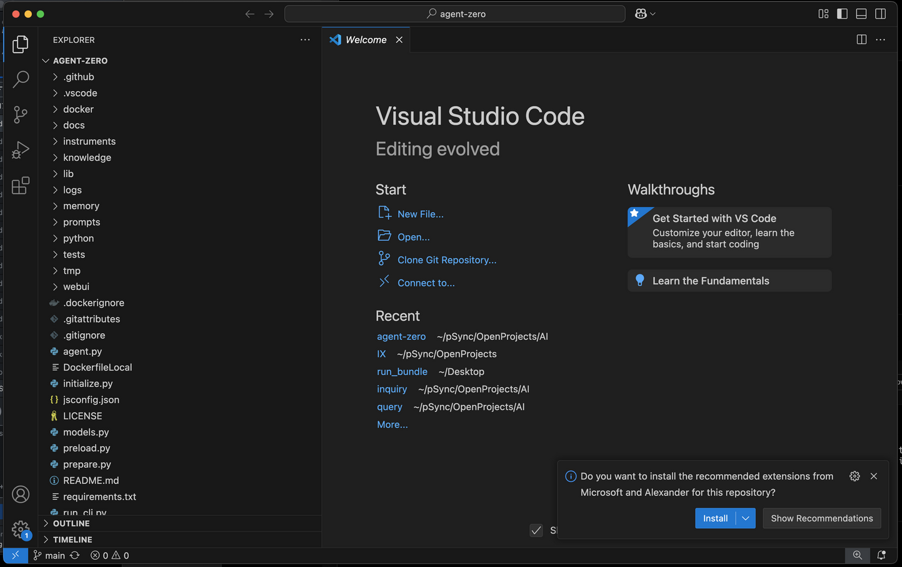

# Step 3: Prepare your IDE:
1. Notice the prompt in lower right corner of the screenshot above to install recommended extensions, this comes from the `.vscode/extensions.json` file. It contains Python language support, debugger and error helper, install them by confirming the popup or manually in Extensions tab of your IDE. These are the extensions mentioned:
```
usernamehw.errorlens
ms-python.debugpy
ms-python.python
```

Now when you select one of the python files in the project, you should see proper Python syntax highlighting and error detection. It should immediately show some errors, because we did not yet install dependencies.
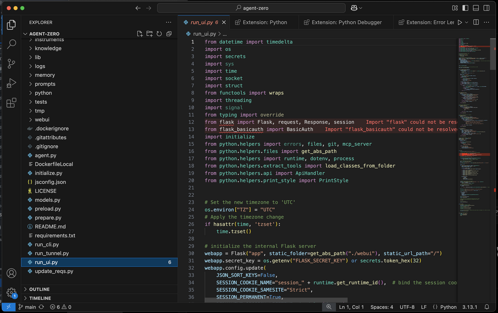

2. Prepare the python environment to run Agent Zero in. (⚠️ This step assumes you have some Python runtime installed.) By clicking the python version in lower right corner (3.13.1 in my example), you should get a list of available environments. You can click the `+ Create Virtual Environment` button. You might be prompted to select the environment manager if you have multiple installed. I have venv and Conda, I will select Conda here. I'm also prompted for desired python version, I will select 3.12, that is known to work well.

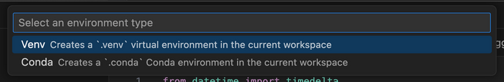

- Your new environment should be automatically activated. If not, select it in the lower right corner. You might need to open a new terminal in VS Code to reflect the changes with `Terminal > New Terminal` or clicking the `+` button in the terminal tab. Your terminal prompt should now start with your environment name/path, in my case `(/Users/frdel/Desktop/agent-zero/.conda)` This shows the environment is active in the terminal.

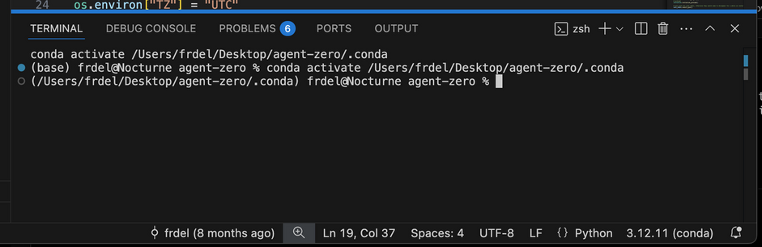

3. Install dependencies. Run these two commands in the terminal:
```bash
pip install -r requirements.txt
playwright install chromium
``` 
These will install all the python packages and browser binaries for playwright (browser agent).
Errors in the code editor caused by missing packages should now be gone. If not, try reloading the window.


## Step 4: Run Agent Zero in the IDE
Great work! Now you should be able to run Agent Zero from your IDE including real-time debugging.
It will not be able to do code execution and few other features requiring the Docker container just yet, but most of the framework will already work.

1. The project is pre-configured for debugging. Go to Debugging tab, select "run_ui.py" and click the green play button (or press F5 by default). The configuration can be found at `.vscode/launch.json`.

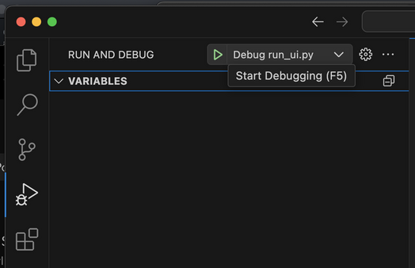

The framework will run at the default port 5000. If you open `http://localhost:5000` in your browser and see `ERR_EMPTY_RESPONSE`, don't panic, you may need to select another port like I did for some reason. If you need to change the defaut port, you can add `"--port=5555"` to the args in the `.vscode/launch.json` file or you can create a `.env` file in the root directory and set the `WEB_UI_PORT` variable to the desired port.

It may take a while the first time. You should see output like the screenshot below. The RFC error is ok for now as we did not yet connect our local development to another instance in docker.
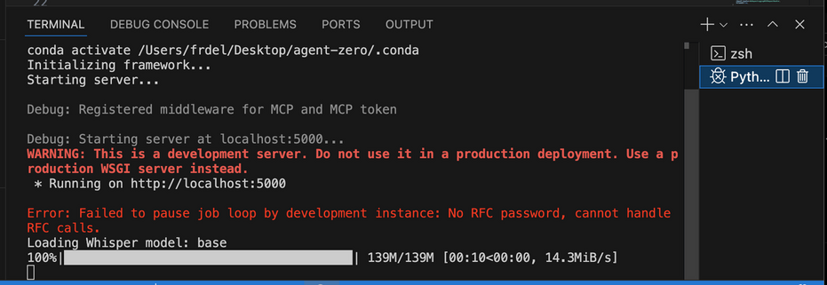


After inserting my API key in settings, my Agent Zero instance works. I can send a simple message and get a response.
⚠️ Some tools like code execution will not work yet as they need to be connected to a Dockerized instance.

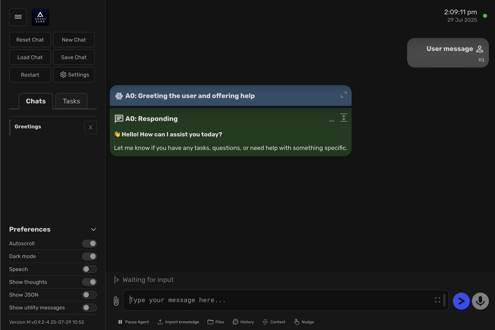


## Debugging
- You can try out the debugger already by placing a breakpoint somewhere in the python code.
- Let's open `python/api/message.py` for example and place a breakpoint at the beginning of the `communicate` function by clicking on the left of the row number. A red dot should appear showing a breakpoint is set.

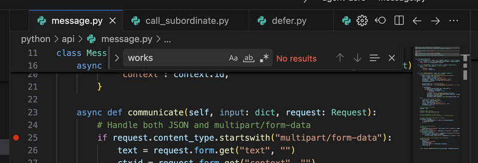

- Now when I send a message in the UI, the debugger will pause the execution at the breakpoint and allow me to inspect all the runtime variables and run the code step by step, even modify the variables or jump to another locations in the code. No more print statements needed!

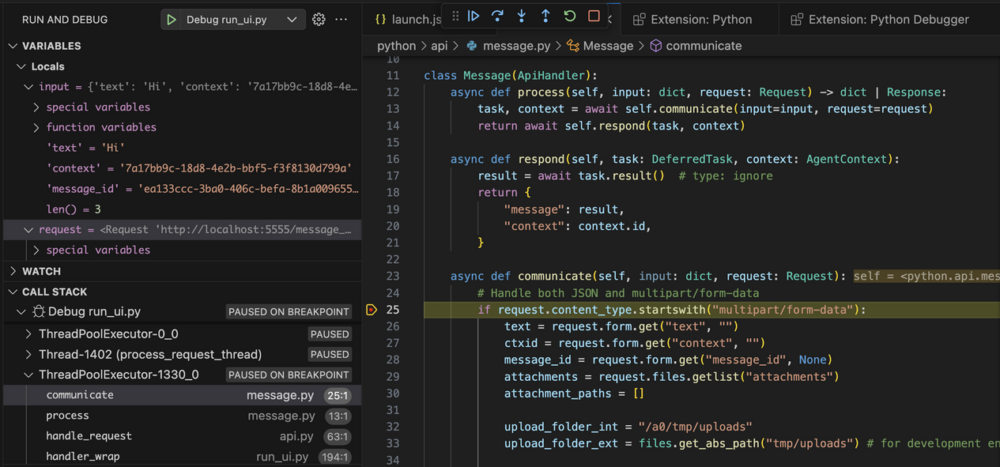


## Step 5: Run another instance of Agent Zero in Docker
- Some parts of A0 require standardized linux environment, additional web services and preinstalled binaries that would be unneccessarily complex to set up in a local environment.
- To make development easier, we can use existing A0 instance in docker and forward some requests to be executed there using SSH and RFC (Remote Function Call).

1. Pull the docker image `agent0ai/agent-zero` from Docker Hub and run it with a web port (`80`) mapped and SSH port (`22`) mapped.
If you want, you can also map the `/a0` folder to our local project folder as well, this way we can update our local instance and the docker instance at the same time.
This is how it looks in my example: port `80` is mapped to `8880` on the host and `22` to `8822`, `/a0` folder mapped to `/Users/frdel/Desktop/agent-zero`:

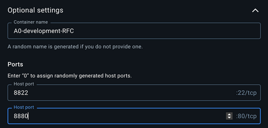
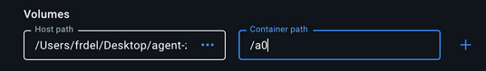


## Step 6: Configure SSH and RFC connection
- The last step is to configure the local development (VS Code) instance and the dockerized instance to communicate with each other. This is very simple and can be done in the settings in the Web UI of both instances.
- In my example the dark themed instance is the VS Code one, the light themed one is the dockerized instance.

1. Open the "Settings" page in the Web UI of your dockerized instance and go in the "Development" section.
2. Set the `RFC Password` field to a new password and save.
3. Open the "Settings" page in the Web UI of your local instance and go in the "Development" section.
4. Here set the `RFC Password` field to the same password you used in the dockerized instance. Also set the SSH port and HTTP port the same numbers you used when creating the container - in my case `8822` for SSH and `8880` for HTTP. The `RFC Destination URL` will most probably stay `localhost` as both instances are running on the host machine.
5. Click save and test by asking your agent to do something in the terminal, like "Get current OS version". It should be able to communicate with the dockerized instance via RFC and SSH and execute the command there, responding with something like "Kali GNU/Linux Rolling".

My Dockerized instance:
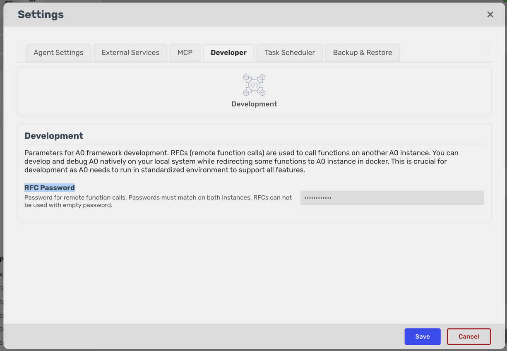

My VS Code instance:
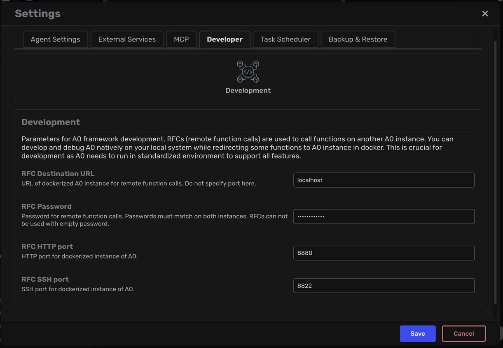


# 🎉 Congratulations! 🚀

You have successfully set up a complete Agent Zero development environment! You now have:

- ✅ A local development instance running in your IDE with full debugging capabilities
- ✅ A dockerized instance for code execution and system operations
- ✅ RFC and SSH communication between both instances
- ✅ The ability to develop, debug, and test Agent Zero features seamlessly

You're now ready to contribute to Agent Zero, create custom extensions, or modify the framework to suit your needs. Happy coding! 💻✨


## Next steps
- See [extensibility](extensibility.md) for instructions on how to create custom extensions.
- See [contribution](contribution.md) for instructions on how to contribute to the framework.

## Want to build your docker image?
- You can use the `DockerfileLocal` to build your docker image.
- Navigate to your project root in the terminal and run `docker build -f DockerfileLocal -t agent-zero-local --build-arg CACHE_DATE=$(date +%Y-%m-%d:%H:%M:%S) .`
- The `CACHE_DATE` argument is optional, it is used to cache most of the build process and only rebuild the last steps when the files or dependencies change.
- See `docker/run/build.txt` for more build command examples.