# Users installation guide for Windows, macOS and Linux

Click to open a video to learn how to install Agent Zero:

[](https://www.youtube.com/watch?v=w5v5Kjx51hs)

The following user guide provides instructions for installing and running Agent Zero using Docker, which is the primary runtime environment for the framework. For developers and contributors, we also provide instructions for setting up the [full development environment](#in-depth-guide-for-full-binaries-installation).


## Windows, macOS and Linux Setup Guide


1. **Install Docker Desktop:** 
- Docker Desktop provides the runtime environment for Agent Zero, ensuring consistent behavior and security across platforms
- The entire framework runs within a Docker container, providing isolation and easy deployment
- Available as a user-friendly GUI application for all major operating systems

1.1. Go to the download page of Docker Desktop [here](https://www.docker.com/products/docker-desktop/). If the link does not work, just search the web for "docker desktop download".

1.2. Download the version for your operating system. For Windows users, the Intel/AMD version is the main download button.

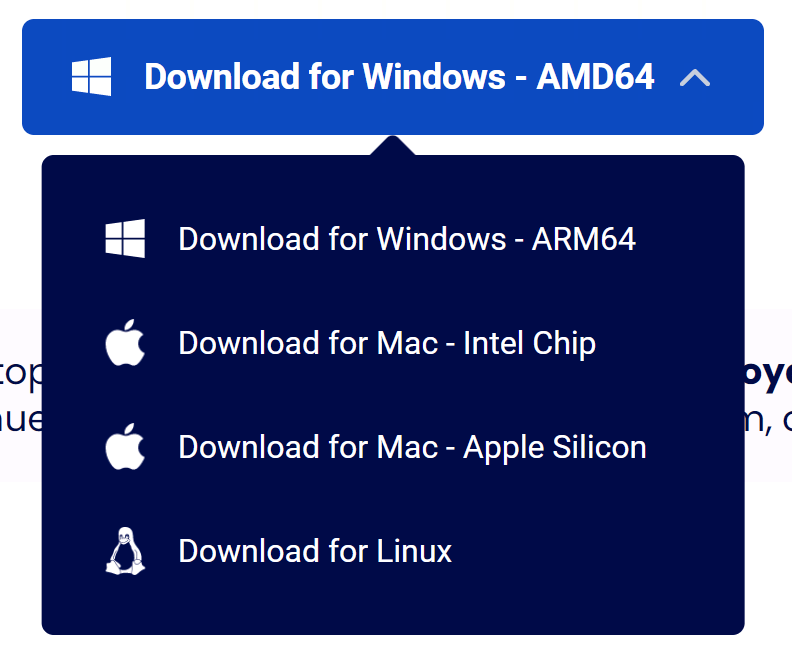
<br><br>

> [!NOTE]
> **Linux Users:** You can install either Docker Desktop or docker-ce (Community Edition). 
> For Docker Desktop, follow the instructions for your specific Linux distribution [here](https://docs.docker.com/desktop/install/linux-install/). 
> For docker-ce, follow the instructions [here](https://docs.docker.com/engine/install/).
>
> If you're using docker-ce, you'll need to add your user to the `docker` group:
> ```bash
> sudo usermod -aG docker $USER
> ```
> Log out and back in, then run:
> ```bash
> docker login
> ```

1.3. Run the installer with default settings. On macOS, drag and drop the application to your Applications folder.

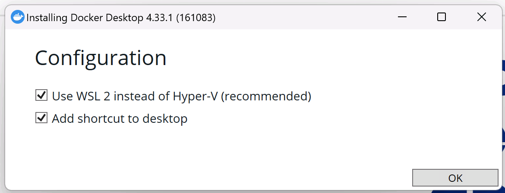


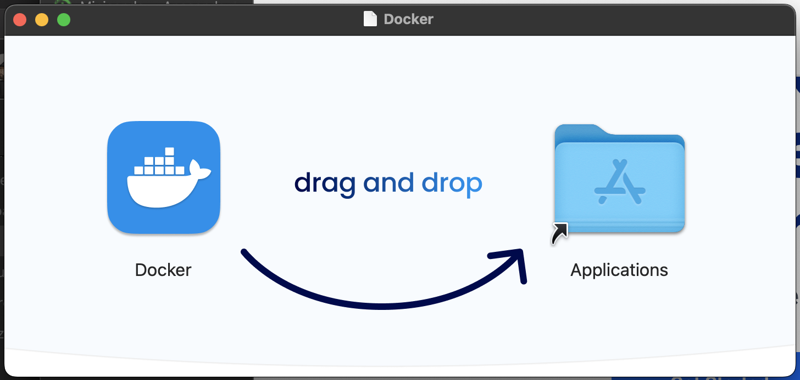
<br><br>

1.4. Once installed, launch Docker Desktop: 

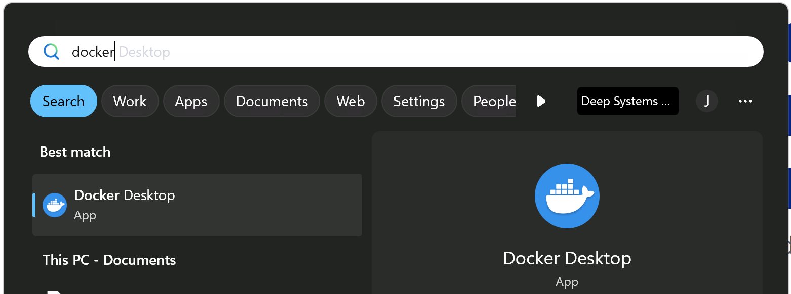

<br><br>

> [!IMPORTANT]  
> **macOS Configuration:** In Docker Desktop's preferences (Docker menu) → Settings → 
> Advanced, enable "Allow the default Docker socket to be used (requires password)."

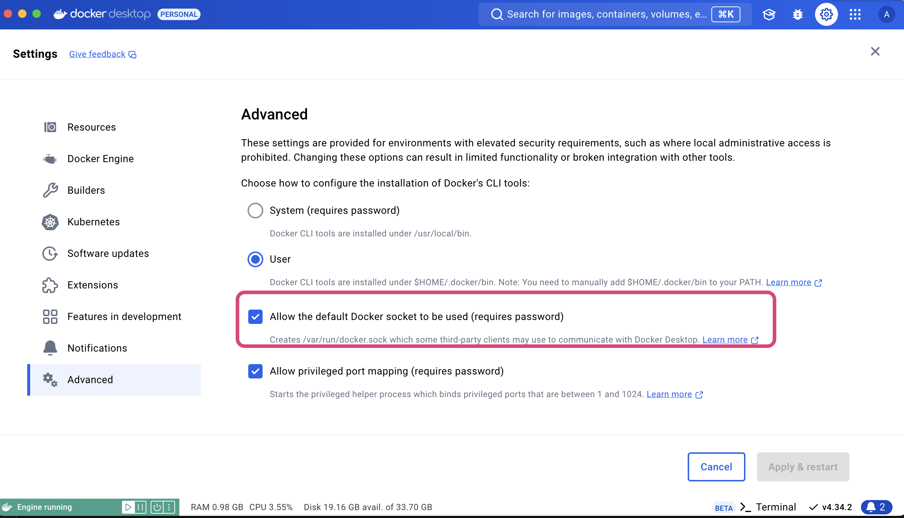

2. **Run Agent Zero:**

- Note: Agent Zero also offers a Hacking Edition based on Kali linux with modified prompts for cybersecurity tasks. The setup is the same as the regular version, just use the agent0ai/agent-zero:hacking image instead of agent0ai/agent-zero.

2.1. Pull the Agent Zero Docker image:
- Search for `agent0ai/agent-zero` in Docker Desktop
- Click the `Pull` button
- The image will be downloaded to your machine in a few minutes

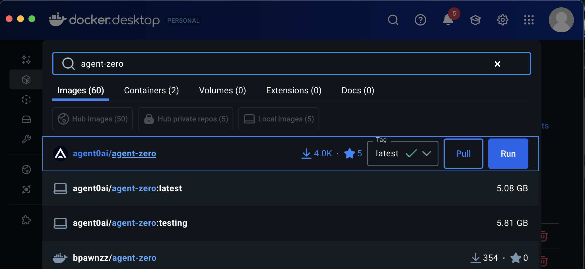

> [!TIP]
> Alternatively, run the following command in your terminal:
>
> ```bash
> docker pull agent0ai/agent-zero
> ```

2.2. Create a data directory for persistence:
- Choose or create a directory on your machine where you want to store Agent Zero's data
- This can be any location you prefer (e.g., `C:/agent-zero-data` or `/home/user/agent-zero-data`)
- This directory will contain all your Agent Zero files, like the legacy root folder structure:
  - `/memory` - Agent's memory and learned information
  - `/knowledge` - Knowledge base
  - `/instruments` - Instruments and functions
  - `/prompts` - Prompt files
  - `/work_dir` - Working directory
  - `.env` - Your API keys
  - `settings.json` - Your Agent Zero settings

> [!TIP]
> Choose a location that's easy to access and backup. All your Agent Zero data 
> will be directly accessible in this directory.

2.3. Run the container:
- In Docker Desktop, go back to the "Images" tab
- Click the `Run` button next to the `agent0ai/agent-zero` image
- Open the "Optional settings" menu
- Set the port to `0` in the second "Host port" field (for automatic port assignment)

Optionally you can map local folders for file persistence:
- Under "Volumes", configure:
  - Host path: Your chosen directory (e.g., `C:\agent-zero-data`)
  - Container path: `/a0`

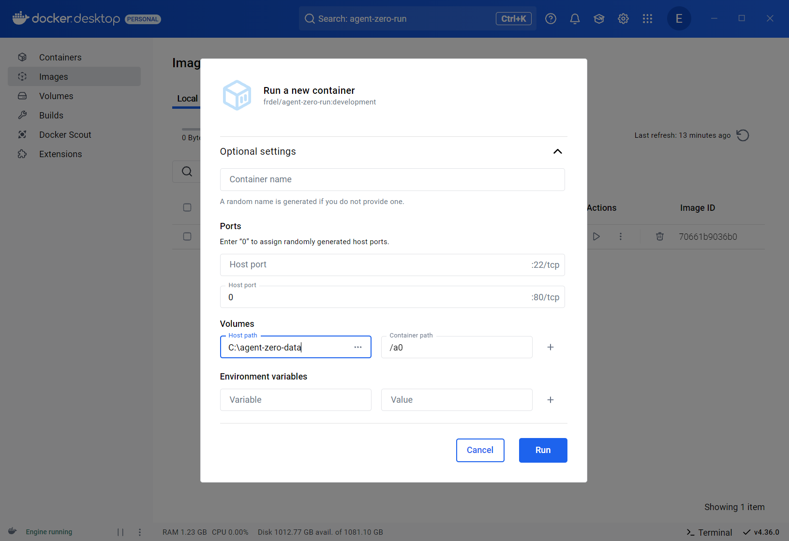

- Click the `Run` button in the "Images" tab.
- The container will start and show in the "Containers" tab


> [!TIP]
> Alternatively, run the following command in your terminal:
> ```bash
> docker run -p $PORT:80 -v /path/to/your/data:/a0 agent0ai/agent-zero
> ```
> - Replace `$PORT` with the port you want to use (e.g., `50080`)
> - Replace `/path/to/your/data` with your chosen directory path

2.4. Access the Web UI:
- The framework will take a few seconds to initialize and the Docker logs will look like the image below.
- Find the mapped port in Docker Desktop (shown as `<PORT>:80`) or click the port right under the container ID as shown in the image below

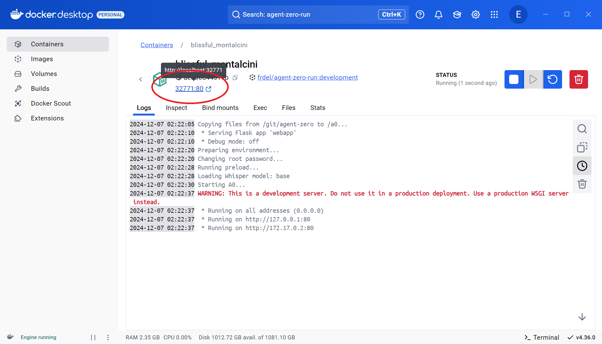

- Open `http://localhost:<PORT>` in your browser
- The Web UI will open. Agent Zero is ready for configuration!

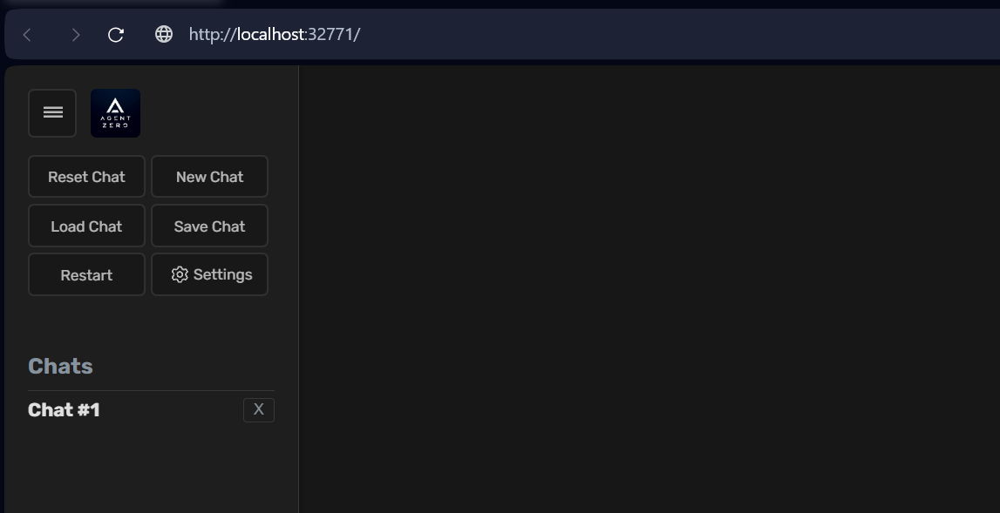

> [!TIP]
> You can also access the Web UI by clicking the ports right under the container ID in Docker Desktop.

> [!NOTE]
> After starting the container, you'll find all Agent Zero files in your chosen 
> directory. You can access and edit these files directly on your machine, and 
> the changes will be immediately reflected in the running container.

3. Configure Agent Zero
- Refer to the following sections for a full guide on how to configure Agent Zero.

## Settings Configuration
Agent Zero provides a comprehensive settings interface to customize various aspects of its functionality. Access the settings by clicking the "Settings"button with a gear icon in the sidebar.

### Agent Configuration
- **Prompts Subdirectory:** Choose the subdirectory within `/prompts` for agent behavior customization. The 'default' directory contains the standard prompts.
- **Memory Subdirectory:** Select the subdirectory for agent memory storage, allowing separation between different instances.
- **Knowledge Subdirectory:** Specify the location of custom knowledge files to enhance the agent's understanding.

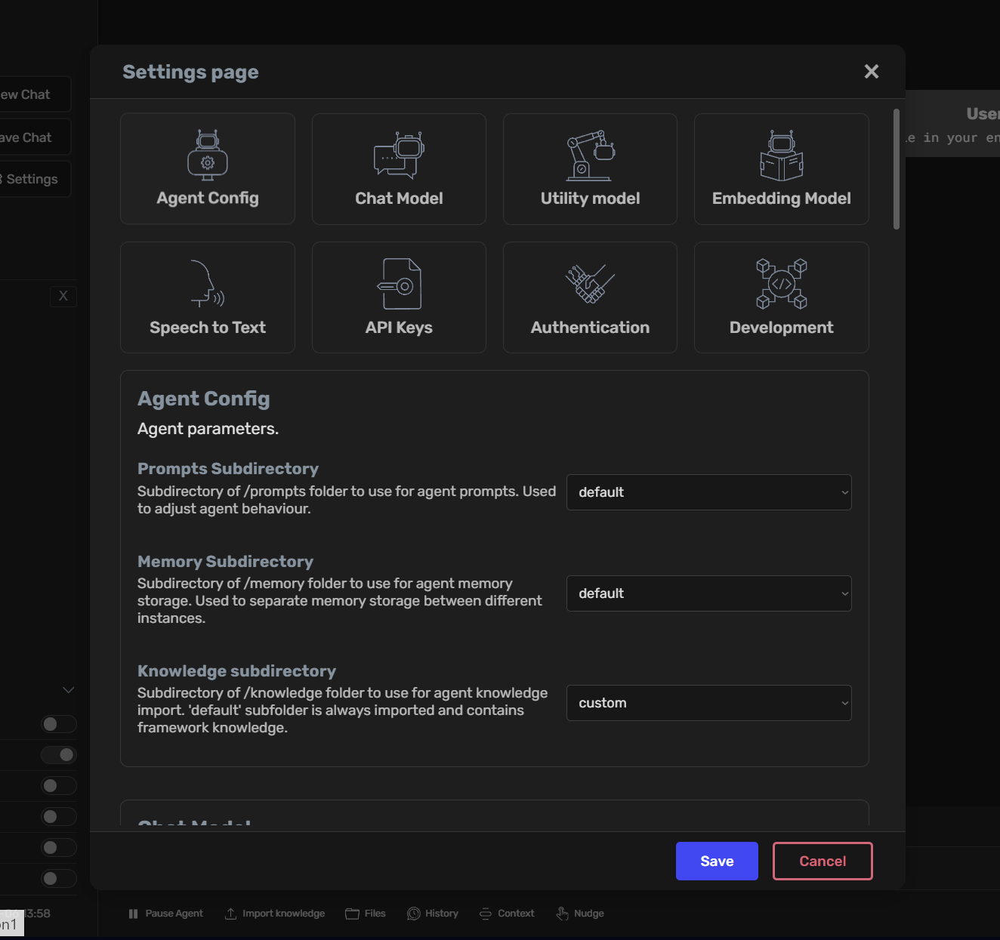

### Chat Model Settings
- **Provider:** Select the chat model provider (e.g., Ollama)
- **Model Name:** Choose the specific model (e.g., llama3.2)
- **Temperature:** Adjust response randomness (0 for deterministic, higher values for more creative responses)
- **Context Length:** Set the maximum token limit for context window
- **Context Window Space:** Configure how much of the context window is dedicated to chat history

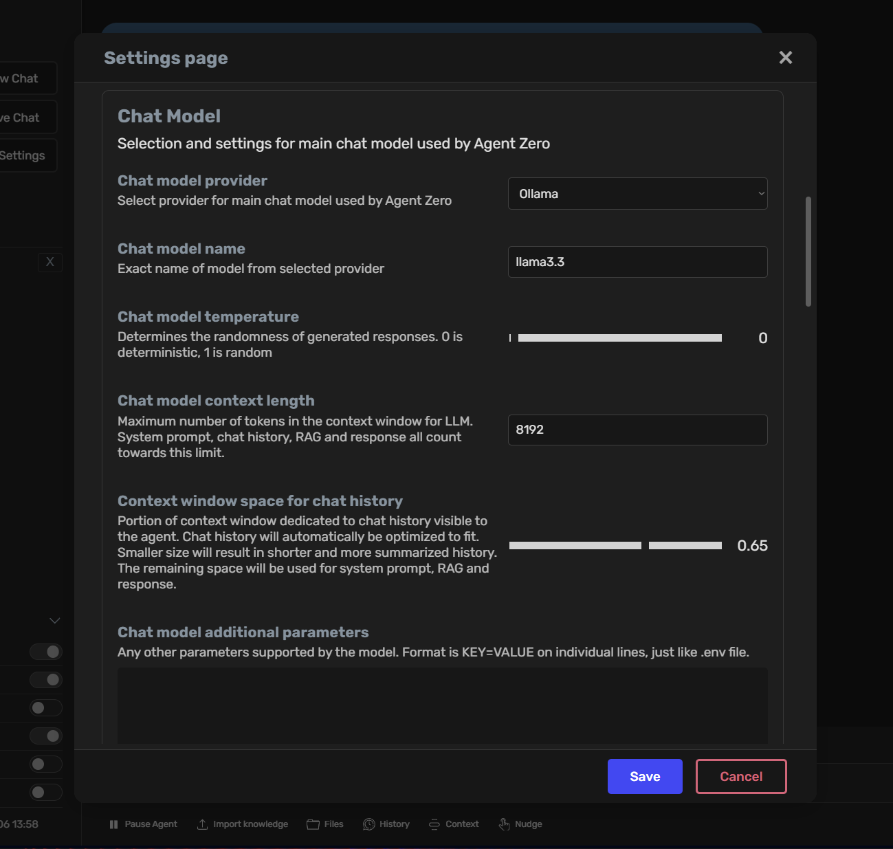

### Utility Model Configuration
- **Provider & Model:** Select a smaller, faster model for utility tasks like memory organization and summarization
- **Temperature:** Adjust the determinism of utility responses

### Embedding Model Settings
- **Provider:** Choose the embedding model provider (e.g., OpenAI)
- **Model Name:** Select the specific embedding model (e.g., text-embedding-3-small)

### Speech to Text Options
- **Model Size:** Choose the speech recognition model size
- **Language Code:** Set the primary language for voice recognition
- **Silence Settings:** Configure silence threshold, duration, and timeout parameters for voice input

### API Keys
- Configure API keys for various service providers directly within the Web UI
- Click `Save` to confirm your settings

### Authentication
- **UI Login:** Set username for web interface access
- **UI Password:** Configure password for web interface security
- **Root Password:** Manage Docker container root password for SSH access

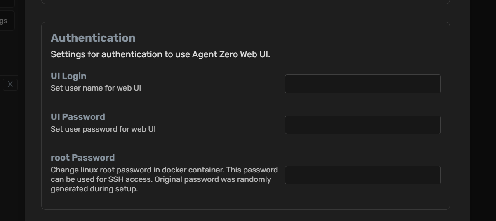

### Development Settings
- **RFC Parameters (local instances only):** configure URLs and ports for remote function calls between instances
- **RFC Password:** Configure password for remote function calls
Learn more about Remote Function Calls and their purpose [here](#7-configure-agent-zero-rfc).

> [!IMPORTANT]
> Always keep your API keys and passwords secure.

# Choosing Your LLMs
The Settings page is the control center for selecting the Large Language Models (LLMs) that power Agent Zero.  You can choose different LLMs for different roles:

| LLM Role | Description |
| --- | --- |
| `chat_llm` | This is the primary LLM used for conversations and generating responses. |
| `utility_llm` | This LLM handles internal tasks like summarizing messages, managing memory, and processing internal prompts.  Using a smaller, less expensive model here can improve efficiency. |
| `embedding_llm` | This LLM is responsible for generating embeddings used for memory retrieval and knowledge base lookups. Changing the `embedding_llm` will re-index all of A0's memory. |

**How to Change:**
1. Open Settings page in the Web UI.
2. Choose the provider for the LLM for each role (Chat model, Utility model, Embedding model) and write the model name.
3. Click "Save" to apply the changes.

## Important Considerations

> [!CAUTION]
> Changing the `embedding_llm` will re-index all the memory and knowledge, and 
> requires clearing the `memory` folder to avoid errors, as the embeddings can't be 
> mixed in the vector database. Note that this will DELETE ALL of Agent Zero's memory.

## Installing and Using Ollama (Local Models)
If you're interested in Ollama, which is a powerful tool that allows you to run various large language models locally, here's how to install and use it:

#### First step: installation
**On Windows:**

Download Ollama from the official website and install it on your machine.

<button>[Download Ollama Setup](https://ollama.com/download/OllamaSetup.exe)</button>

**On macOS:**
```
brew install ollama
```
Otherwise choose macOS installer from the [official website](https://ollama.com/).

**On Linux:**
```bash
curl -fsSL https://ollama.com/install.sh | sh
```

**Finding Model Names:**
Visit the [Ollama model library](https://ollama.com/library) for a list of available models and their corresponding names.  The format is usually `provider/model-name` (or just `model-name` in some cases).

#### Second step: pulling the model
**On Windows, macOS, and Linux:**
```
ollama pull <model-name>
```

1. Replace `<model-name>` with the name of the model you want to use.  For example, to pull the Mistral Large model, you would use the command `ollama pull mistral-large`.

2. A CLI message should confirm the model download on your system

#### Selecting your model within Agent Zero
1. Once you've downloaded your model(s), you must select it in the Settings page of the GUI. 

2. Within the Chat model, Utility model, or Embedding model section, choose Ollama as provider.

3. Write your model code as expected by Ollama, in the format `llama3.2` or `qwen2.5:7b`

4. Click `Save` to confirm your settings.

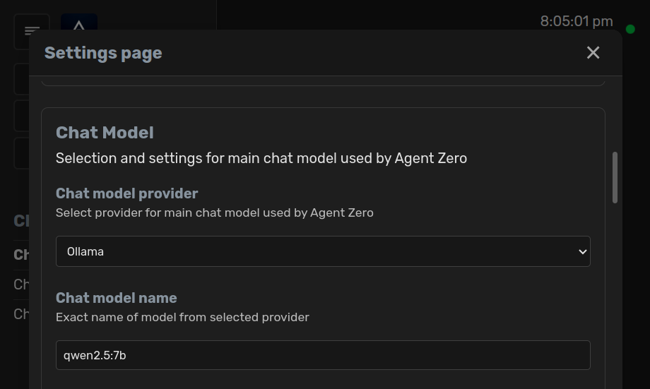

#### Managing your downloaded models
Once you've downloaded some models, you might want to check which ones you have available or remove any you no longer need.

- **Listing downloaded models:** 
  To see a list of all the models you've downloaded, use the command:
  ```
  ollama list
  ```
- **Removing a model:**
  If you need to remove a downloaded model, you can use the `ollama rm` command followed by the model name:
  ```
  ollama rm <model-name>
  ```


- Experiment with different model combinations to find the balance of performance and cost that best suits your needs. E.g., faster and lower latency LLMs will help, and you can also use `faiss_gpu` instead of `faiss_cpu` for the memory.

## Using Agent Zero on your mobile device
Agent Zero's Web UI is accessible from any device on your network through the Docker container:

1. The Docker container automatically exposes the Web UI on all network interfaces
2. Find the mapped port in Docker Desktop:
   - Look under the container name (usually in the format `<PORT>:80`)
   - For example, if you see `32771:80`, your port is `32771`
3. Access the Web UI from any device using:
   - Local access: `http://localhost:<PORT>`
   - Network access: `http://<YOUR_COMPUTER_IP>:<PORT>`

> [!TIP]
> - Your computer's IP address is usually in the format `192.168.x.x` or `10.0.x.x`
> - You can find your external IP address by running `ipconfig` (Windows) or `ifconfig` (Linux/Mac)
> - The port is automatically assigned by Docker unless you specify one

> [!NOTE]
> If you're running Agent Zero directly on your system (legacy approach) instead of 
> using Docker, you'll need to configure the host manually in `run_ui.py` to run on all interfaces using `host="0.0.0.0"`.

For developers or users who need to run Agent Zero directly on their system,see the [In-Depth Guide for Full Binaries Installation](#in-depth-guide-for-full-binaries-installation).

# How to update Agent Zero

1. **If you come from the previous version of Agent Zero:**
- Your data is safely stored across various directories and files inside the Agent Zero folder.
- To update to the new Docker runtime version, you might want to backup the following files and directories:
  - `/memory` - Agent's memory
  - `/knowledge` - Custom knowledge base (if you imported any custom knowledge files)
  - `/instruments` - Custom instruments and functions (if you created any custom)
  - `/tmp/settings.json` - Your Agent Zero settings
  - `/tmp/chats/` - Your chat history
- Once you have saved these files and directories, you can proceed with the Docker runtime [installation instructions above](#windows-macos-and-linux-setup-guide) setup guide.
- Reach for the folder where you saved your data and copy it to the new Agent Zero folder set during the installation process.
- Agent Zero will automatically detect your saved data and use it across memory, knowledge, instruments, prompts and settings.

> [!IMPORTANT]
> If you have issues loading your settings, you can try to delete the `/tmp/settings.json` file and let Agent Zero generate a new one.
> The same goes for chats in `/tmp/chats/`, they might be incompatible with the new version

2. **Update Process (Docker Desktop)**
- Go to Docker Desktop and stop the container from the "Containers" tab
- Right-click and select "Remove" to remove the container
- Go to "Images" tab and remove the `agent0ai/agent-zero` image or click the three dots to pull the difference and update the Docker image.


- Search and pull the new image if you chose to remove it
- Run the new container with the same volume settings as the old one

> [!IMPORTANT]
> Make sure to use the same volume mount path when running the new
> container to preserve your data. The exact path depends on where you stored
> your Agent Zero data directory (the chosen directory on your machine).

> [!TIP]
> Alternatively, run the following commands in your terminal:
>
> ```bash
> # Stop the current container
> docker stop agent-zero
>
> # Remove the container (data is safe in the folder)
> docker rm agent-zero
>
> # Remove the old image
> docker rmi agent0ai/agent-zero
>
> # Pull the latest image
> docker pull agent0ai/agent-zero
>
> # Run new container with the same volume mount
> docker run -p $PORT:80 -v /path/to/your/data:/a0 agent0ai/agent-zero
> ```

3. **Full Binaries**
- Using Git/GitHub: Pull the latest version of the Agent Zero repository. 
- The custom knowledge, solutions, memory, and other data will get ignored, so you don't need to worry about losing any of your custom data. The same goes for your .env file with all of your API keys and settings.json.

> [!WARNING]  
> - If you update manually, beware: save your .env file with the API keys, and look for new dependencies in requirements.txt. 
> - If any changes are made to the requirements of the updated version, you have to execute this command inside the a0 conda env after activating it:
> ```bash
> pip install -r requirements.txt

# In-Depth Guide for Full Binaries Installation
- Agent Zero is a framework. It's made to be customized, edited, enhanced. Therefore you need to install the necessary components to run it when downloading its full binaries. This guide will help you to do so.
- The following step by step instructions can be followed along with a video for this tutorial on how to make Agent Zero work with its full development environment.

[](https://youtu.be/8H7mFsvxKYQ)

## Reminders:
1. There's no need to install Python, Conda will manage that for you.
2. You don't necessarily need API keys: Agent Zero can run with local models. For this tutorial though, we will leave it to the default OpenAI API. A guide for downloading Ollama along with local models is available [here](#installing-and-using-ollama-local-models).
3. Visual Studio Code or any other code editor is not mandatory, but it makes it easier to navigate and edit files.
4. Git/GitHub is not mandatory, you can download the framework files through your browser. We will not be showing how to use Git in this tutorial.
5. Docker is not mandatory for the full binaries installation, since the framework will run on your machine connecting to the Docker container through the Web UI RFC functionality.
6. Running Agent Zero without Docker makes the process more complicated and it's thought for developers and contributors.

> [!IMPORTANT]  
> Linux instructions are provided as general instructions for any Linux distribution. If you're using a distribution other than Debian/Ubuntu, you may need to adjust the instructions accordingly.
>
> For Debian/Ubuntu, just follow the macOS instructions, as they are the same.

## 1. Install Conda (miniconda)
- Conda is a Python environment manager, it will help you keep your projects and installations separated. 
- It's a lightweight version of Anaconda that includes only conda, Python, the packages they depend on, and a small number of other useful packages, including pip, zlib and a few others.

1. Go to the download page of miniconda [here](https://docs.anaconda.com/miniconda/#miniconda-latest-installer-links). If the link does not work, just search the web for "miniconda download".
2. Based on your operating system, download the right installer of miniconda. For macOS select the version with "pkg" at the end.


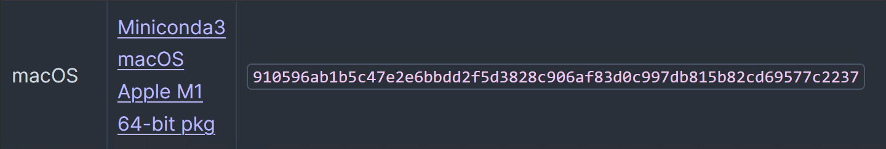
<br><br>

3. Run the installer and go through the installation process, here you can leave everything to default and just click Next, Next... The same goes for macOS with the "pkg" graphical installer.

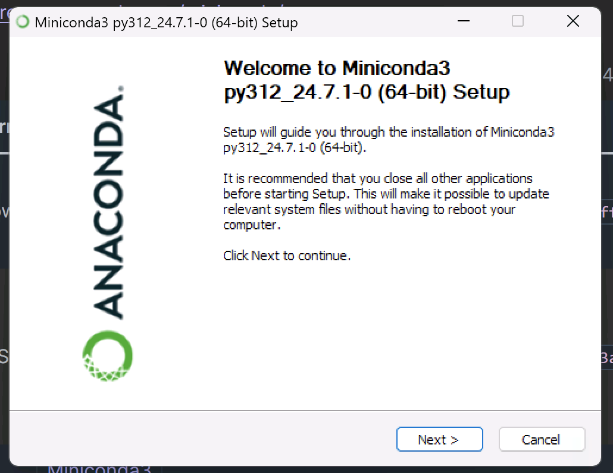

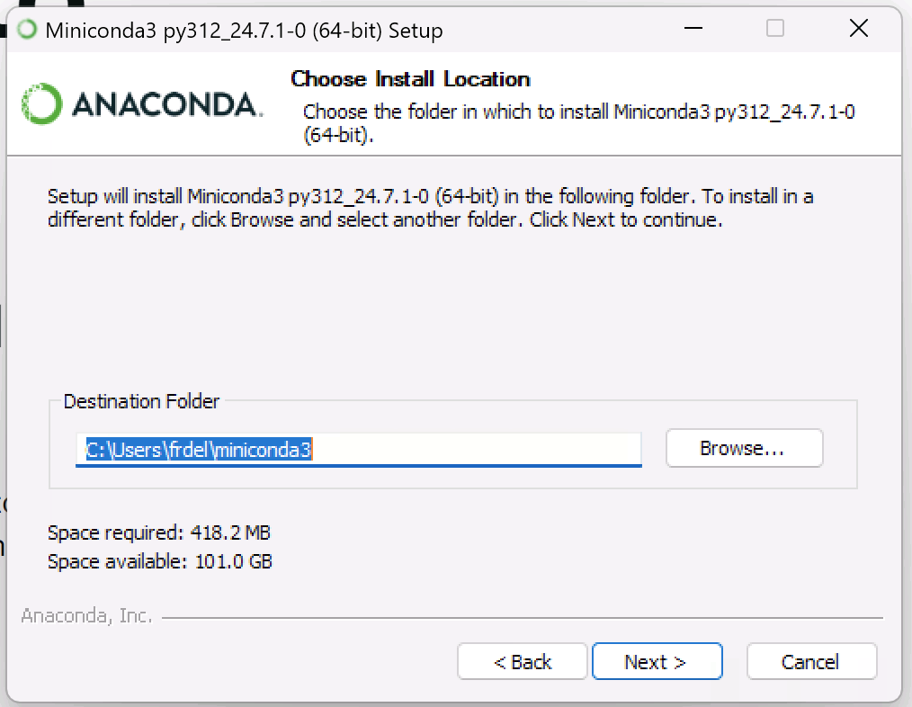

<br><br>

4. After the installation is complete, you should have "Anaconda Powershell Prompt" installed on your Windows machine. On macOS, when you open the Terminal application in your Applications folder and type "conda --version", you should see the version installed.

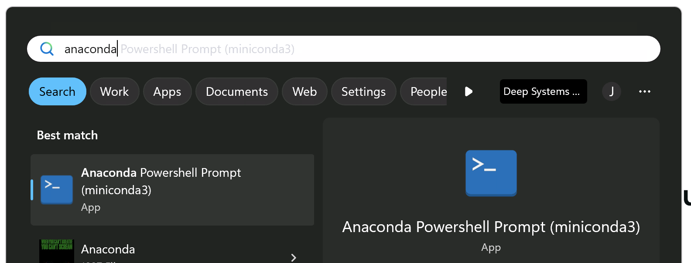
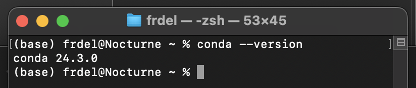
<br><br>


## 2. Download Agent Zero
- You can clone the Agent Zero repository (https://github.com/agent0ai/agent-zero) from GitHub if you know how to use Git. In this tutorial I will just show how to download the files.

1. Go to the Agent Zero releases [here](https://github.com/agent0ai/agent-zero/releases).
2. The latest release is on the top of the list, click the "Source Code (zip)" button under "Assets" to download it.

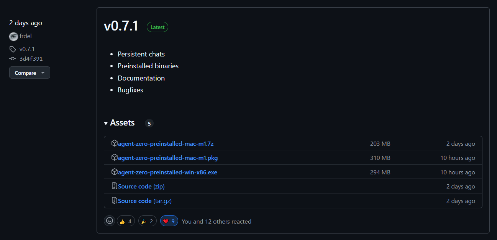
<br><br>

3. Extract the downloaded archive where you want to have it. I will extract them to "agent-zero" folder on my Desktop - "C:\Users\frdel\Desktop\agent-zero" on Windows and "/Users/frdel/Desktop/agent-zero" on macOS.

## 3. Set up Conda environment
- Now that we have the project files and Conda, we can create **virtual Python environment** for this project, activate it and install requirements.

1. Open your **"Anaconda Powershell Prompt"** application on windows or **"Terminal"** application on macOS.
2. In the terminal, navigate to your Agent Zero folder using **"cd"** command. Replace the path with your actual Agent Zero folder path.
~~~
cd C:\Users\frdel\Desktop\agent-zero
~~~
You should see your folder has changed on the next terminal line.

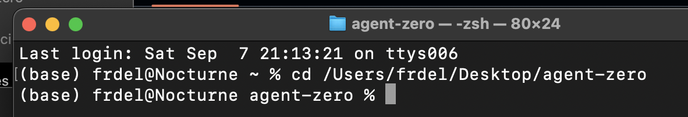
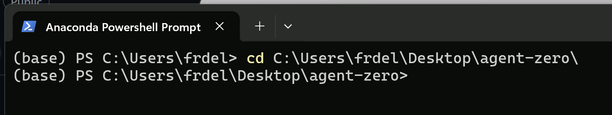
<br><br>

3. Create Conda environment using command **"conda create"**. After **"-n"** is your environment name, you can choose your own, i will use **"a0"** - short for Agent Zero. After **"python"** is the Python version that Conda will install for you into this environment, right now, 3.12 works fine. **-y** skips confirmations.
~~~
conda create -n a0 python=3.12 -y
~~~

4. Once done, activate the new environment for this terminal window by another command:
~~~
conda activate a0
~~~
And you should see that the **(base)** on the left has changed to **(a0)**. This means that this terminal now uses the new **a0** virtual environment and all packages will be installed into this environment.


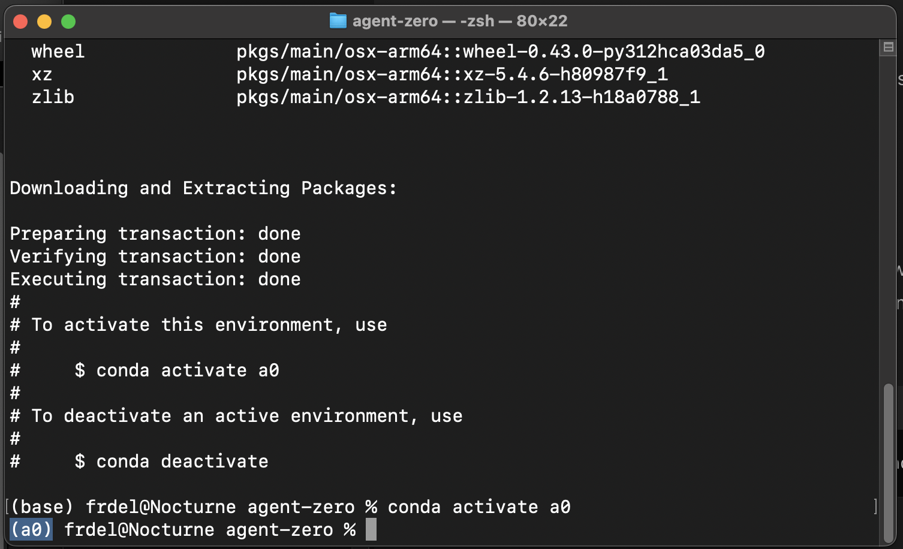
<br><br>

> [!IMPORTANT]  
> If you open a new terminal window, you will need to activate the environment with 
> "conda activate a0" again for that window.

5. Install requirements using **"pip"**. Pip is a Python package manager. We can install all required packages from requirements.txt file using command:
~~~
pip install -r requirements.txt
~~~
This might take some time. If you get any errors regarding version conflicts and compatibility, double check that your environment is activated and that you created that environment with the correct Python version.


<br><br>

## 4. Install Docker (Docker Desktop application)
Simply put, Docker is a way of running virtual computers on your machine. These are lightweight, disposable and isolated from your operating system, so it is a way to sandbox Agent Zero.
- Agent Zero only connects to the Docker container when it needs to execute code and commands. The frameworks itself runs on your machine.
- Docker has a desktop application with GUI for all major operating system, which is the recommended way to install it.

1. Go to the download page of Docker Desktop [here](https://www.docker.com/products/docker-desktop/). If the link does not work, just search the web for "docker desktop download".
2. Download the version for your operating system. Don't be tricked by the seemingly missing windows intel/amd version, it's the button itself, not in the dropdown menu.


<br><br>

3. Run the installer and go through the installation process. It should be even shorter than Conda installation, you can leave everything to default. On macOS, the installer is a "dmg" image, so just drag and drop the application to your Applications folder like always.


<br><br>


4. Once installed, you should see Docker Desktop application on your Windows/Mac machine. 


<br><br>

5. Create account in the application.
- It's required to be signed in to the Docker Hub, so create a free account in the Docker Desktop application, you will be prompted when the application first runs.

> [!IMPORTANT]  
> **Important macOS-only Docker Configuration:** In Docker Desktop's preferences 
> (Docker menu) go to Settings, navigate to "Advanced" and check "Allow the default 
> Docker socket to be used (requires password)."  This allows Agent Zero to 
> communicate with the Docker daemon.


> [!NOTE]
> **Linux Users:** You can install both Docker Desktop or docker-ce (Community Edition). 
> For Docker Desktop, follow the instructions for your specific Linux distribution [here](https://docs.docker.com/desktop/install/linux-install/). 
> For docker-ce, follow the instructions [here](https://docs.docker.com/engine/install/).
>
> If you're using docker-ce, you will need to add your user to the `docker` group to be able to run docker commands without sudo. You can do this by running the following command in your terminal: `sudo usermod -aG docker $USER`. Then log out and log back in for the changes to take effect.
>
> Login in the Docker CLI with `docker login` and provide your Docker Hub credentials.

6. Pull the Docker image
- Agent Zero needs a Docker image to be pulled from the Docker Hub to be run, even when using the full binaries.
You can refer to the [installation instructions above](#windows-macos-and-linux-setup-guide) to run the Docker container and then resume from the next step. There are two differences:
  - You need to map two ports instead of one:
    - 55022 in the first field to run the Remote Function Call SSH
    - 0 in the second field to run the Web UI in automatic port assignment
  - You need to map the `/a0` volume to the location of your local Agent Zero folder.
- Run the Docker container following the instructions.

## 5. Run the local Agent Zero instance
Run the Agent Zero with Web UI:
~~~
python run_ui.py
~~~

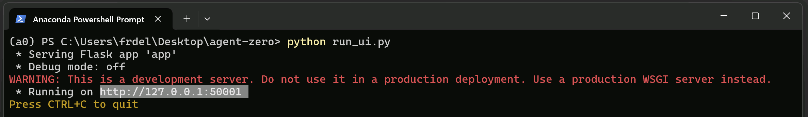
<br><br>

- Open the URL shown in terminal in your web browser. You should see the Agent Zero interface.

## 6. Configure Agent Zero
Now we can configure Agent Zero - select models, settings, API Keys etc. Refer to the [Usage](usage.md#agent-configuration) guide for a full guide on how to configure Agent Zero.

## 7. Configure Agent Zero RFC
Agent Zero needs to be configured further to redirect some functions to the Docker container. This is crucial for development as A0 needs to run in a standardized environment to support all features.
1. Go in "Settings" page in the Web UI of your local instance and go in the "Development" section.
2. Set "RFC Destination URL" to `http://localhost`
3. Set the two ports (HTTP and SSH) to the ones used when creating the Docker container
4. Click "Save"


5. Go in "Settings" page in the Web UI of your Docker instance and go in the "Development" section.


6. This time the page has only the password field, set it to the same password you used when creating the Docker container.
7. Click "Save"
8. Use the Development environment
9. Now you have the full development environment to work on Agent Zero.

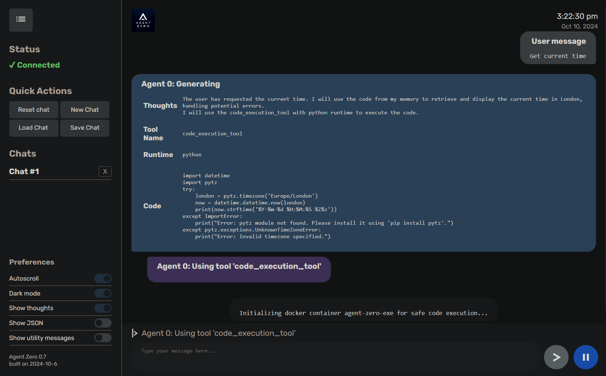

<br><br>

      
### Conclusion
After following the instructions for your specific operating system, you should have Agent Zero successfully installed and running. You can now start exploring the framework's capabilities and experimenting with creating your own intelligent agents. 

If you encounter any issues during the installation process, please consult the [Troubleshooting section](troubleshooting.md) of this documentation or refer to the Agent Zero [Skool](https://www.skool.com/agent-zero) or [Discord](https://discord.gg/Z2tun2N3) community for assistance.

