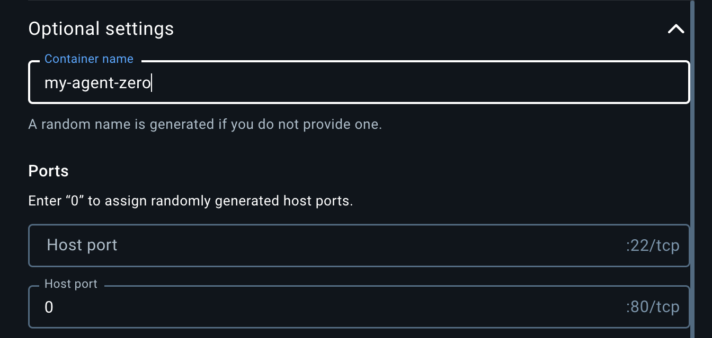
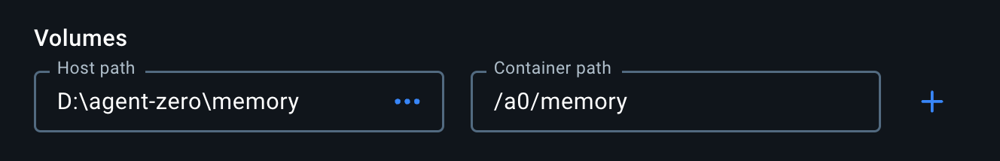

# Users installation guide for Windows, macOS and Linux

Click to open a video to learn how to install Agent Zero:

[](https://www.youtube.com/watch?v=w5v5Kjx51hs)

The following user guide provides instructions for installing and running Agent Zero using Docker, which is the primary runtime environment for the framework. For developers and contributors, we also provide instructions for setting up the [full development environment](#in-depth-guide-for-full-binaries-installation).


## Windows, macOS and Linux Setup Guide


1. **Install Docker Desktop:** 
- Docker Desktop provides the runtime environment for Agent Zero, ensuring consistent behavior and security across platforms
- The entire framework runs within a Docker container, providing isolation and easy deployment
- Available as a user-friendly GUI application for all major operating systems

1.1. Go to the download page of Docker Desktop [here](https://www.docker.com/products/docker-desktop/). If the link does not work, just search the web for "docker desktop download".

1.2. Download the version for your operating system. For Windows users, the Intel/AMD version is the main download button.


<br><br>

> [!NOTE]
> **Linux Users:** You can install either Docker Desktop or docker-ce (Community Edition). 
> For Docker Desktop, follow the instructions for your specific Linux distribution [here](https://docs.docker.com/desktop/install/linux-install/). 
> For docker-ce, follow the instructions [here](https://docs.docker.com/engine/install/).
>
> If you're using docker-ce, you'll need to add your user to the `docker` group:
> ```bash
> sudo usermod -aG docker $USER
> ```
> Log out and back in, then run:
> ```bash
> docker login
> ```

1.3. Run the installer with default settings. On macOS, drag and drop the application to your Applications folder.


<br><br>

1.4. Once installed, launch Docker Desktop: 


<br><br>

> [!NOTE]
> **MacOS Configuration:** In Docker Desktop's preferences (Docker menu) → Settings → 
> Advanced, enable "Allow the default Docker socket to be used (requires password)."


2. **Run Agent Zero:**

- Note: Agent Zero also offers a Hacking Edition based on Kali linux with modified prompts for cybersecurity tasks. The setup is the same as the regular version, just use the agent0ai/agent-zero:hacking image instead of agent0ai/agent-zero.

2.1. Pull the Agent Zero Docker image:
- Search for `agent0ai/agent-zero` in Docker Desktop
- Click the `Pull` button
- The image will be downloaded to your machine in a few minutes


> [!TIP]
> Alternatively, run the following command in your terminal:
>
> ```bash
> docker pull agent0ai/agent-zero
> ```

2.2. OPTIONAL - Create a data directory for persistence:

> [!CAUTION]
> Preferred way of persisting Agent Zero data is to use the backup and restore feature.
> By mapping the whole `/a0` directory to a local directory, you will run into problems when upgrading Agent Zero to a newer version.

- Choose or create a directory on your machine where you want to store Agent Zero's data
- This can be any location you prefer (e.g., `C:/agent-zero-data` or `/home/user/agent-zero-data`)
- You can map individual subfolders of `/a0` to a local directory or the full `/a0` directory (not recommended).
- This directory will contain all your Agent Zero files, like the legacy root folder structure:
  - `/agents` - Specialized agents with their prompts and tools
  - `/memory` - Agent's memory and learned information
  - `/knowledge` - Knowledge base
  - `/instruments` - Instruments and functions
  - `/prompts` - Prompt files
  - `/work_dir` - Working directory
  - `.env` - Your API keys
  - `/tmp/settings.json` - Your Agent Zero settings

> [!TIP]
> Choose a location that's easy to access and backup. All your Agent Zero data 
> will be directly accessible in this directory.

2.3. Run the container:
- In Docker Desktop, go back to the "Images" tab
- Click the `Run` button next to the `agent0ai/agent-zero` image
- Open the "Optional settings" menu
- Set the web port (80) to desired host port number in the second "Host port" field or set to `0` for automatic port assignment

Optionally you can map local folders for file persistence:
> [!CAUTION]
> Preferred way of persisting Agent Zero data is to use the backup and restore feature.
> By mapping the whole `/a0` directory to a local directory, you will run into problems when upgrading Agent Zero to a newer version.
- OPTIONAL: Under "Volumes", configure your mapped folders, if needed:
  - Example host path: Your chosen directory (e.g., `C:\agent-zero\memory`)
  - Example container path: `/a0/memory`


- Click the `Run` button in the "Images" tab.




- The container will start and show in the "Containers" tab


> [!TIP]
> Alternatively, run the following command in your terminal:
> ```bash
> docker run -p $PORT:80 -v /path/to/your/data:/a0 agent0ai/agent-zero
> ```
> - Replace `$PORT` with the port you want to use (e.g., `50080`)
> - Replace `/path/to/your/data` with your chosen directory path

2.4. Access the Web UI:
- The framework will take a few seconds to initialize and the Docker logs will look like the image below.
- Find the mapped port in Docker Desktop (shown as `<PORT>:80`) or click the port right under the container ID as shown in the image below


- Open `http://localhost:<PORT>` in your browser
- The Web UI will open. Agent Zero is ready for configuration!


> [!TIP]
> You can also access the Web UI by clicking the ports right under the container ID in Docker Desktop.

> [!NOTE]
> After starting the container, you'll find all Agent Zero files in your chosen 
> directory. You can access and edit these files directly on your machine, and 
> the changes will be immediately reflected in the running container.

3. Configure Agent Zero
- Refer to the following sections for a full guide on how to configure Agent Zero.

## Settings Configuration
Agent Zero provides a comprehensive settings interface to customize various aspects of its functionality. Access the settings by clicking the "Settings"button with a gear icon in the sidebar.

### Agent Configuration
- **Prompts Subdirectory:** Choose the subdirectory within `/prompts` for agent behavior customization. The 'default' directory contains the standard prompts.
- **Memory Subdirectory:** Select the subdirectory for agent memory storage, allowing separation between different instances.
- **Knowledge Subdirectory:** Specify the location of custom knowledge files to enhance the agent's understanding.


### Chat Model Settings
- **Provider:** Select the chat model provider (e.g., Ollama)
- **Model Name:** Choose the specific model (e.g., llama3.2)
- **Temperature:** Adjust response randomness (0 for deterministic, higher values for more creative responses)
- **Context Length:** Set the maximum token limit for context window
- **Context Window Space:** Configure how much of the context window is dedicated to chat history


### Utility Model Configuration
- **Provider & Model:** Select a smaller, faster model for utility tasks like memory organization and summarization
- **Temperature:** Adjust the determinism of utility responses

### Embedding Model Settings
- **Provider:** Choose the embedding model provider (e.g., OpenAI)
- **Model Name:** Select the specific embedding model (e.g., text-embedding-3-small)

### Speech to Text Options
- **Model Size:** Choose the speech recognition model size
- **Language Code:** Set the primary language for voice recognition
- **Silence Settings:** Configure silence threshold, duration, and timeout parameters for voice input

### API Keys
- Configure API keys for various service providers directly within the Web UI
- Click `Save` to confirm your settings

### Authentication
- **UI Login:** Set username for web interface access
- **UI Password:** Configure password for web interface security
- **Root Password:** Manage Docker container root password for SSH access


### Development Settings
- **RFC Parameters (local instances only):** configure URLs and ports for remote function calls between instances
- **RFC Password:** Configure password for remote function calls
Learn more about Remote Function Calls and their purpose [here](#7-configure-agent-zero-rfc).

> [!IMPORTANT]
> Always keep your API keys and passwords secure.

# Choosing Your LLMs
The Settings page is the control center for selecting the Large Language Models (LLMs) that power Agent Zero.  You can choose different LLMs for different roles:

| LLM Role | Description |
| --- | --- |
| `chat_llm` | This is the primary LLM used for conversations and generating responses. |
| `utility_llm` | This LLM handles internal tasks like summarizing messages, managing memory, and processing internal prompts.  Using a smaller, less expensive model here can improve efficiency. |
| `embedding_llm` | This LLM is responsible for generating embeddings used for memory retrieval and knowledge base lookups. Changing the `embedding_llm` will re-index all of A0's memory. |

**How to Change:**
1. Open Settings page in the Web UI.
2. Choose the provider for the LLM for each role (Chat model, Utility model, Embedding model) and write the model name.
3. Click "Save" to apply the changes.

## Important Considerations

## Installing and Using Ollama (Local Models)
If you're interested in Ollama, which is a powerful tool that allows you to run various large language models locally, here's how to install and use it:

#### First step: installation
**On Windows:**

Download Ollama from the official website and install it on your machine.

<button>[Download Ollama Setup](https://ollama.com/download/OllamaSetup.exe)</button>

**On macOS:**
```
brew install ollama
```
Otherwise choose macOS installer from the [official website](https://ollama.com/).

**On Linux:**
```bash
curl -fsSL https://ollama.com/install.sh | sh
```

**Finding Model Names:**
Visit the [Ollama model library](https://ollama.com/library) for a list of available models and their corresponding names.  The format is usually `provider/model-name` (or just `model-name` in some cases).

#### Second step: pulling the model
**On Windows, macOS, and Linux:**
```
ollama pull <model-name>
```

1. Replace `<model-name>` with the name of the model you want to use.  For example, to pull the Mistral Large model, you would use the command `ollama pull mistral-large`.

2. A CLI message should confirm the model download on your system

#### Selecting your model within Agent Zero
1. Once you've downloaded your model(s), you must select it in the Settings page of the GUI. 

2. Within the Chat model, Utility model, or Embedding model section, choose Ollama as provider.

3. Write your model code as expected by Ollama, in the format `llama3.2` or `qwen2.5:7b`

4. Provide your API base URL to your ollama API endpoint, usually `http://host.docker.internal:11434`

5. Click `Save` to confirm your settings.


#### Managing your downloaded models
Once you've downloaded some models, you might want to check which ones you have available or remove any you no longer need.

- **Listing downloaded models:** 
  To see a list of all the models you've downloaded, use the command:
  ```
  ollama list
  ```
- **Removing a model:**
  If you need to remove a downloaded model, you can use the `ollama rm` command followed by the model name:
  ```
  ollama rm <model-name>
  ```


- Experiment with different model combinations to find the balance of performance and cost that best suits your needs. E.g., faster and lower latency LLMs will help, and you can also use `faiss_gpu` instead of `faiss_cpu` for the memory.

## Using Agent Zero on your mobile device
Agent Zero's Web UI is accessible from any device on your network through the Docker container:

> [!NOTE]
> In settings, External Services tab, you can enable Cloudflare Tunnel to expose your Agent Zero instance to the internet.
> ⚠️ Do not forget to set username and password in the settings Authentication tab to secure your instance on the internet.

1. The Docker container automatically exposes the Web UI on all network interfaces
2. Find the mapped port in Docker Desktop:
   - Look under the container name (usually in the format `<PORT>:80`)
   - For example, if you see `32771:80`, your port is `32771`
3. Access the Web UI from any device using:
   - Local access: `http://localhost:<PORT>`
   - Network access: `http://<YOUR_COMPUTER_IP>:<PORT>`

> [!TIP]
> - Your computer's IP address is usually in the format `192.168.x.x` or `10.0.x.x`
> - You can find your external IP address by running `ipconfig` (Windows) or `ifconfig` (Linux/Mac)
> - The port is automatically assigned by Docker unless you specify one

> [!NOTE]
> If you're running Agent Zero directly on your system (legacy approach) instead of 
> using Docker, you'll need to configure the host manually in `run_ui.py` to run on all interfaces using `host="0.0.0.0"`.

For developers or users who need to run Agent Zero directly on their system,see the [In-Depth Guide for Full Binaries Installation](#in-depth-guide-for-full-binaries-installation).

# How to update Agent Zero

> [!NOTE]
> Since v0.9, Agent Zero has a Backup and Restore feature, so you don't need to backup the files manually.
> In Settings, Backup and Restore tab will guide you through the process.

1. **If you come from the previous version of Agent Zero:**
- Your data is safely stored across various directories and files inside the Agent Zero folder.
- To update to the new Docker runtime version, you might want to backup the following files and directories:
  - `/memory` - Agent's memory
  - `/knowledge` - Custom knowledge base (if you imported any custom knowledge files)
  - `/instruments` - Custom instruments and functions (if you created any custom)
  - `/tmp/settings.json` - Your Agent Zero settings
  - `/tmp/chats/` - Your chat history
- Once you have saved these files and directories, you can proceed with the Docker runtime [installation instructions above](#windows-macos-and-linux-setup-guide) setup guide.
- Reach for the folder where you saved your data and copy it to the new Agent Zero folder set during the installation process.
- Agent Zero will automatically detect your saved data and use it across memory, knowledge, instruments, prompts and settings.

> [!IMPORTANT]
> If you have issues loading your settings, you can try to delete the `/tmp/settings.json` file and let Agent Zero generate a new one.
> The same goes for chats in `/tmp/chats/`, they might be incompatible with the new version

2. **Update Process (Docker Desktop)**
- Go to Docker Desktop and stop the container from the "Containers" tab
- Right-click and select "Remove" to remove the container
- Go to "Images" tab and remove the `agent0ai/agent-zero` image or click the three dots to pull the difference and update the Docker image.


- Search and pull the new image if you chose to remove it
- Run the new container with the same volume settings as the old one

> [!IMPORTANT]
> Make sure to use the same volume mount path when running the new
> container to preserve your data. The exact path depends on where you stored
> your Agent Zero data directory (the chosen directory on your machine).

> [!TIP]
> Alternatively, run the following commands in your terminal:
>
> ```bash
> # Stop the current container
> docker stop agent-zero
>
> # Remove the container (data is safe in the folder)
> docker rm agent-zero
>
> # Remove the old image
> docker rmi agent0ai/agent-zero
>
> # Pull the latest image
> docker pull agent0ai/agent-zero
>
> # Run new container with the same volume mount
> docker run -p $PORT:80 -v /path/to/your/data:/a0 agent0ai/agent-zero
> ```

      
### Conclusion
After following the instructions for your specific operating system, you should have Agent Zero successfully installed and running. You can now start exploring the framework's capabilities and experimenting with creating your own intelligent agents. 

If you encounter any issues during the installation process, please consult the [Troubleshooting section](troubleshooting.md) of this documentation or refer to the Agent Zero [Skool](https://www.skool.com/agent-zero) or [Discord](https://discord.gg/B8KZKNsPpj) community for assistance.

