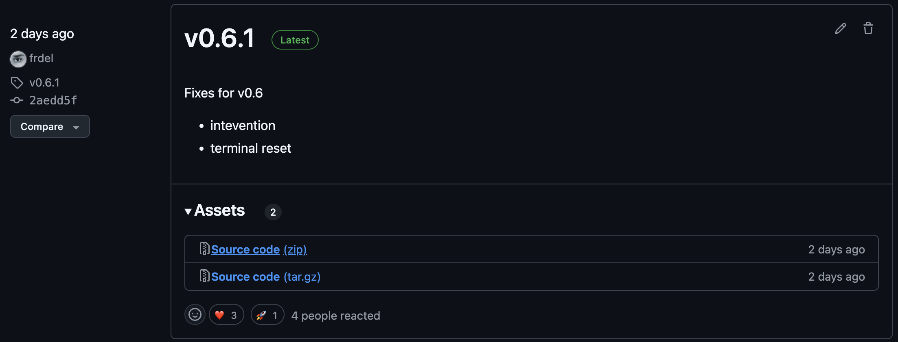
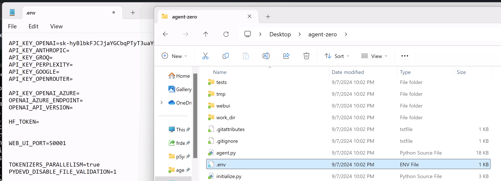
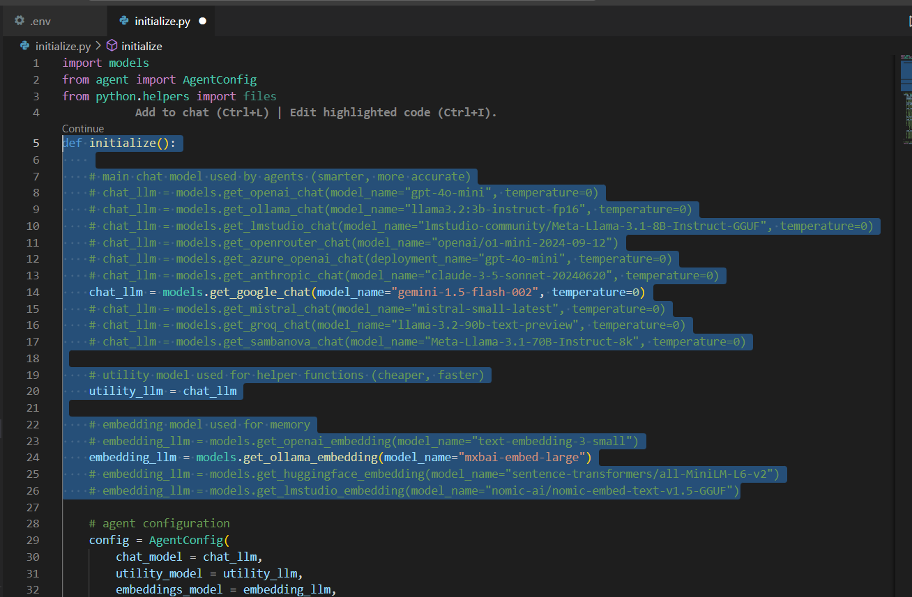

# Installation guide for Windows, macOS and Linux

[](https://youtu.be/8H7mFsvxKYQ)

The following guide provides both quick start instructions for the full installation of Agent Zero on various operating systems and in-depth guides for Windows and macOS with screenshots.

## You were looking for this? [How to update Agent Zero](#how-to-update-agent-zero)

<details>
<summary><h2>Windows Quick Start</h2></summary>

1. **Install Anaconda or Miniconda:** Download and install the appropriate version for your system from [here](https://docs.anaconda.com/anaconda/install/). Miniconda is recommended for a minimal installation.
2. **Create an Environment:** Open Anaconda Navigator (or use the `conda` command), create an environment named `agent-zero`, and select Python 3.12.
3. **Install Docker Desktop:** Download and install Docker Desktop from [here](https://www.docker.com/products/docker-desktop/).
4. **Download Agent Zero:** Download the latest release zip from the [GitHub releases page](https://github.com/frdel/agent-zero/releases) and extract it.
5. **Configure API Keys:** Duplicate `example.env`, rename it to `.env`, and add your API keys.
6. **Install Requirements:** Activate your `agent-zero` environment, open a terminal in the Agent Zero directory, and run: `pip install -r requirements.txt`
7. **Run Agent Zero (Web UI):** Execute `python run_ui.py` in your terminal.
8. **Access the Web UI:** Open the URL displayed in your browser.

</details>

<details>
<summary><h2>macOS Quick Start</h2></summary>

1. **Install Miniconda:** Download the pkg installer from [here](https://docs.anaconda.com/miniconda/#miniconda-latest-installer-links) and follow the instructions.
2. **Install Docker Desktop:** Download the dmg image from [here](https://www.docker.com/products/docker-desktop/), drag the Docker application to your Applications folder, and create a Docker Hub account.
3. **Download Agent Zero:** Download the latest release zip from the [GitHub releases page](https://github.com/frdel/agent-zero/releases) and extract it.
4. **Open Terminal:** Navigate to the Agent Zero directory.
5. **Create Conda Environment:** Run: `conda create -n a0 python=3.12 -y`
6. **Activate Environment:** Run: `conda activate a0`
7. **Install Requirements:** Run: `pip install -r requirements.txt`
8. **Configure API Keys:** Create a `.env` file and add your keys.
9. **Run Agent Zero (Web UI):** Run: `python run_ui.py`
10. **Access the Web UI:** Open the displayed URL.

> [!IMPORTANT]  
> **Important macOS Docker Configuration:** In Docker Desktop's preferences (Docker 
> menu) go to Settings, navigate to "Advanced" and check "Allow the default Docker 
> socket to be used (requires password)."  This allows Agent Zero to communicate 
> with the Docker daemon.


</details>

<details>
<summary><h2>Linux Quick Start</h1></summary>

1. **Install Python and Pip:** Use your distribution's package manager (e.g., `apt`, `yum`, `dnf`) to install Python 3.12 or higher and pip. On Debian/Ubuntu systems, you would typically use:
   ```bash
   sudo apt-get update
   sudo apt-get install python3.12 python3-pip
   ```
2. **Install Miniconda:** Download the appropriate installer for your Linux distribution from [here](https://docs.anaconda.com/miniconda/#miniconda-latest-installer-links) and follow the instructions.
3. **Install Docker:** Install Docker Desktop or Docker CE using your distribution's package manager. Make sure the Docker service is running: `sudo systemctl start docker`
4. **Download Agent Zero:** Download the latest release zip from the [GitHub releases page](https://github.com/frdel/agent-zero/releases) and extract it.
5. **Open Terminal and Navigate:** Open your terminal and navigate to the extracted Agent Zero folder using the `cd` command.
6. **Create and Activate Conda Environment:**
   ```bash
   conda create -n a0 python=3.12 -y
   conda activate a0
   ```
7. **Install Requirements:** `pip install -r requirements.txt`
8. **Configure API Keys:** Create a `.env` file in the project root and add your API keys. You can copy the `example.env` file and rename it to `.env`.
9. **Run Agent Zero (Web UI):** `python run_ui.py`
10. **Access the Web UI:** Open the URL displayed in your terminal.

</details>

# In-Depth Guide for Windows and macOS
- Agent Zero is not an app. It's a framework. It's made to be customized, edited, enhanced. Therefore you need to install the necessary components to run it.
- The following step by step instructions can be followed along with a video for this tutorial on how to make Agent Zero work on Windows and macOS that you find in the [top section](#installation-guide-for-windows-macos-and-linux) of the page.

## Reminders:
1. There's no need to install Python, Conda will manage that for you.
2. You don't necessarily need API keys: Agent Zero can run with local models. For this tutorial though, we will leave it to the default OpenAI API. A simple video explanation for running Free and Local models is available [in this video](https://www.youtube.com/watch?v=sLMhLRHDIPY&t=80s).
3. Visual Studio Code or any other code editor is not mandatory, but it makes it easier to navigate and edit files.
4. Docker is not mandatory, but running Agent Zero without Docker is actually more complicated and can be very dangerous, so we will be covering the easier and recommended way - using Docker Desktop application.
5. Git/GitHub is not mandatory, you can download the framework files through your browser. We will not be showing how to use Git in this tutorial.

## 1. Install Conda (miniconda)
- Conda is a python environment manager, it will help you keep your projects and installations separated. Full Conda has many more features, but you only need "miniconda".

1. Go to the download page of miniconda [here](https://docs.anaconda.com/miniconda/#miniconda-latest-installer-links). If the link does not work, just search the web for "miniconda download".
2. Based on your operating system, download the right installer of miniconda. For macOS select the version with "pkg" at the end.


<br><br>

3. Run the installer and go through the installation process, here you can leave everything to default and just click Next, Next... The same goes for macOS with the "pkg" graphical installer.


<br><br>

4. After the installation is complete, you should have "Anaconda Powershell Prompt" installed on your Windows machine. On macOS, when you open the Terminal application in your Applications folder and type "conda --version", you should see the version installed.


<br><br>

## 2. Install Docker (Docker Desktop application)
- Simply put, Docker is a way of running virtual computers on your machine. These are lightweight, disposable and isolated from your operating system, so it is a way to sandbox Agent Zero.
- Agent Zero only connects to the Docker container when it needs to execute code and commands. The frameworks itself runs on your machine.
- Running Agent Zero without Docker is possible, but more complicated and dangerous, I will not be covering that in this tutorial.
- Docker has a desktop application with GUI for all major operating system, so I will be using that.

1. Go to the download page of Docker Desktop [here](https://www.docker.com/products/docker-desktop/). If the link does not work, just search the web for "docker desktop download".
2. Download the version for your operating system. Don't be tricked by the seemingly missing windows intel/amd version, it's the button itself, not in the dropdown menu.


<br><br>

3. Run the installer and go through the installation process. It should be even shorter than Conda installation, you can leave everything to default. On macOS, the installer is a "dmg" image, so just drag and drop the application to your Applications folder like always.


<br><br>


4. Once installed, you should see Docker Desktop application on your Windows/Mac machine. 


<br><br>

5. Create account in the application.
No need to create images or containers, the framework will do that for you. However, this requires you to be signed in to the Docker Hub, so create a free account in the Docker Desktop application, you will be prompted when the application first runs.

> [!IMPORTANT]  
> **Important macOS-only Docker Configuration:** In Docker Desktop's preferences 
> (Docker menu) go to Settings, navigate to "Advanced" and check "Allow the default 
> Docker socket to be used (requires password)."  This allows Agent Zero to 
> communicate with the Docker daemon.


## 3. Download Agent Zero
- You can clone the Agent Zero repository (https://github.com/frdel/agent-zero) from GitHub if you know how to use Git. In this tutorial I will just show how to download the files.

1. Go to the Agent Zero releases [here](https://github.com/frdel/agent-zero/releases).
2. The latest release is on the top of the list, click the "Source Code (zip)" button under "Assets" to download it.


<br><br>

3. Extract the downloaded archive where you want to have it. I will extract them to "agent-zero" folder on my Desktop - "C:\Users\frdel\Desktop\agent-zero" on Windows and "/Users/frdel/Desktop/agent-zero" on macOS.


## 4. Set up Conda environment
- Now that we have the project files and Conda, we can create **virtual Python environment** for this project, activate it and install requirements.

1. Open your **"Anaconda Powershell Prompt"** application on windows or **"Terminal"** application on macOS.
2. In the terminal, navigate to your Agent Zero folder using **"cd"** command. Replace the path with your actual Agent Zero folder path.
~~~
cd C:\Users\frdel\Desktop\agent-zero
~~~
You should see your folder has changed on the next terminal line.


<br><br>

3. Create Conda environment using command **"conda create"**. After **"-n"** is your environment name, you can choose your own, i will use **"a0"** - short for Agent Zero. After **"python"** is the Python version that Conda will install for you into this environment, right now, 3.12 works fine. **-y** skips confirmations.
~~~
conda create -n a0 python=3.12 -y
~~~

4. Once done, activate the new environment for this terminal window by another command:
~~~
conda activate a0
~~~
And you should see that the **(base)** on the left has changed to **(a0)**. This means that this terminal now uses the new **a0** virtual environment and all packages will be installed into this environment.


<br><br>

> [!IMPORTANT]  
> If you open a new terminal window, you will need to activate the environment with 
> "conda activate a0" again for that window.

5. Install requirements using **"pip"**. Pip is a Python package manager. We can install all required packages from requirements.txt file using command:
~~~
pip install -r requirements.txt
~~~
This might take some time. If you get any errors regarding version conflicts and compatibility, double check that your environment is activated and that you created that environment with the correct Python version.


<br><br>

## 5. Configure Agent Zero
- Now we can configure Agent Zero - select models, settings, API Keys etc.
- I will leave the default configuration using OpenAI API and I will just provide my OpenAI API key in the **.env** file.

1. Find the **"example.env"** file in your Agent Zero folder and edit the contents. I will put my OpenAI API key after **"API_KEY_OPENAI="**. If you have API keys for other service providers, add them as needed.
2. Rename the **"example.env"** file to **".env"**. This is important, only this exact "**.env**" file name is valid.


<br><br>

3. (Optional) Change models or setting in **"initialize.py"** file if needed as detailed [here](#choosing-your-llms).

## 6. Run Agent Zero
- Setup done. It's time to test Agent Zero. Let's double check:

1. Make sure you have the **"a0"** Conda environment still active in your current terminal window. You can see that on the left of each terminal line like **(a0)** or **(base)**. If not, activate again with **"conda activate a0"** command again.
2. Make sure your terminal is looking into the Agent Zero folder. If not, navigate to it with **"cd"** command again with your path.
3. Run the **Docker Desktop application** you installed and just leave it running in the background. No need to create images or containers, the framework will do that for you. However, this requires you to be signed in to the Docker Hub, so sign in in the Docker Desktop application, if you haven't already.
4. Run the Agent Zero with Web UI:
~~~
python run_ui.py
~~~


<br><br>

5. Open the URL shown in terminal in your web browser. You should see the Agent Zero interface. The first time it needs to execute code, Docker image will be downloaded and deployed, this might take some time. Be patient when seeing "Initializing docker container agent-zero-exe for safe code execution...".


<br><br>

# Choosing Your LLMs
The `initialize.py` file is the control center for selecting the Large Language Models (LLMs) that power Agent Zero.  You can choose different LLMs for different roles:

| LLM Role | Description |
| --- | --- |
| `chat_llm` | This is the primary LLM used for conversations and generating responses. |
| `utility_llm` | This LLM handles internal tasks like summarizing messages, managing memory, and processing internal prompts.  Using a smaller, less expensive model here can improve efficiency. |
| `embedding_llm` | This LLM is responsible for generating embeddings used for memory retrieval and knowledge base lookups. Changing the `embedding_llm` will re-index all of A0's memory. |

**How to Change:**
1. Open `initialize.py`.
2. Locate the lines where these LLMs are initialized (at the beginning of the file).
3. Uncomment the line for the provider and model you want to use, and comment out the others.  For example, to use `gpt-4o-mini` for chat:
   ```python
   chat_llm = models.get_openai_chat(model_name="gpt-4o-mini", temperature=0)
   ```
4. Ensure only one model is uncommented for each LLM role.

## Important Considerations

> [!CAUTION]
> Changing the `embedding_llm` will re-index all the memory and knowledge, and 
> requires clearing the `memory` folder to avoid errors, as the embeddings can't be 
> mixed in the vector database. Note that this will DELETE ALL of Agent Zero's memory.

- Experiment with different model combinations to find the balance of performance and cost that best suits your needs. E.g., faster and lower latency LLMs will help, and you can also use `faiss_gpu` instead of `faiss_cpu` for the memory.

## Installing and Using Ollama (Local Models)
If you're interested in Ollama, which is a powerful tool that allows you to run various large language models locally, here's how to install and use it:

#### First step: installation
**On Windows:**

Download Ollama from the official website and install it on your machine.

<button>[Download Ollama Setup](https://ollama.com/download/OllamaSetup.exe)</button>

**On macOS:**
```
brew install ollama
```
Otherwise choose macOS installer from the [official website](https://ollama.com/).

**On Linux:**
```bash
curl -fsSL https://ollama.com/install.sh | sh
```

**Finding Model Names:**
Visit the [Ollama model library](https://ollama.com/library) for a list of available models and their corresponding names.  The format is usually `provider/model-name` (or just `model-name` in some cases).

#### Second step: pulling the model
**On Windows, macOS, and Linux:**
```
ollama pull <model-name>
```

Replace `<model-name>` with the name of the model you want to use.  For example, to pull the Mistral Large model, you would use the command `ollama pull mistral-large`.

#### Managing your downloaded models
Once you've downloaded some models, you might want to check which ones you have available or remove any you no longer need.

- **Listing downloaded models:** 
  To see a list of all the models you've downloaded, use the command:
  ```
  ollama list
  ```
- **Removing a model:**
  If you need to remove a downloaded model, you can use the `ollama rm` command followed by the model name:
  ```
  ollama rm <model-name>
  ```

# How to update Agent Zero
To update Agent Zero to the latest version, follow these steps:
- **Using Git/GitHub:** Pull the latest version of the Agent Zero repository with Git/GitHub. The custom knowledge, solutions, memory, and other data will get ignored by Git, so you don't need to worry about losing any of your custom data. The same goes for your .env file with all of your API keys.
- **Backup LLM choices**: Before updating, make sure to save your customizations you've made to the first part of `def_initialize` function in the `initialize.py` file to choose your LLMs (highlighted section in below figure). This is important because the update process will overwrite these files with the default versions from the repository and can save you time rewriting all your LLMs choices.



Beware of indentations when pasting the model selection code back into the `initialize.py` file after the update.

- **Manual Update:** Alternatively, you can manually download the latest version of Agent Zero from the [releases page](https://github.com/frdel/agent-zero/releases). The only folders that you must save to retain custom data are the following: `/memory`, `/knowledge`. If you have created custom `instruments` or `prompts` you must save their dirs as well.

> [!IMPORTANT]  
> If you update manually, beware: save your .env file with the API keys, and look 
> for new dependencies in requirements.txt. If any changes are made in the updated 
> version, you have to execute this command inside the a0 conda env after activating it:
      
      pip install -r requirements.txt

# How to create executable files for Agent Zero in Windows, macOS and Linux
Two scripts allows you to easily create executable files for Windows, macOS and Linux, including all the necessary dependencies to run Agent Zero without the need for Python, Conda, or additional steps:
1. **Navigate to Bundle folder:** Navigate to /agent-zero/bundle.
2. **Run the script:** Run the bundling of Agent Zero by running `macos_bundle.sh` (macOS and Linux) or `windows_bundle.bat` (Windows) in your terminal window. The process usually takes about 2 to 5 minutes depending on the platform.
3. **Edit your Files:** Now you can configure API keys and edit `initialize.py` for [Choosing Your LLMs](#choosing-your-llms).
4. **Run Agent Zero:** Run Agent Zero by running the .exe file just created (Windows), or by running `./agent-zero` in your terminal window.

> [!WARNING]  
> The 2 scripts will create executable files valid only for the machine where they 
> are run. If you want to run Agent Zero on another machine, you will need to run 
> the scripts on that machine as well to have executable files.
      
### Conclusion
After following the instructions for your specific operating system, you should have Agent Zero successfully installed and running. You can now start exploring the framework's capabilities and experimenting with creating your own intelligent agents.  If you encounter any issues during the installation process, please consult the Troubleshooting section of this documentation or refer to the Agent Zero community for assistance.