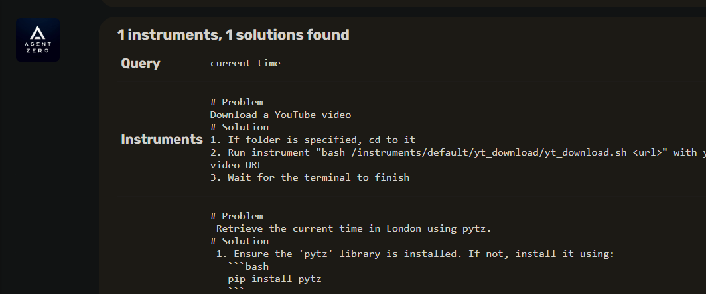
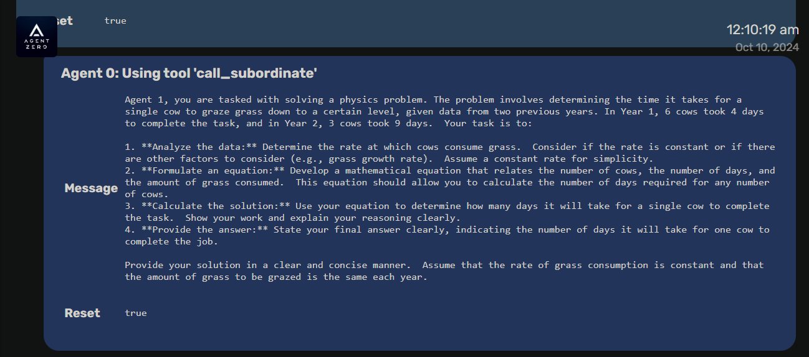
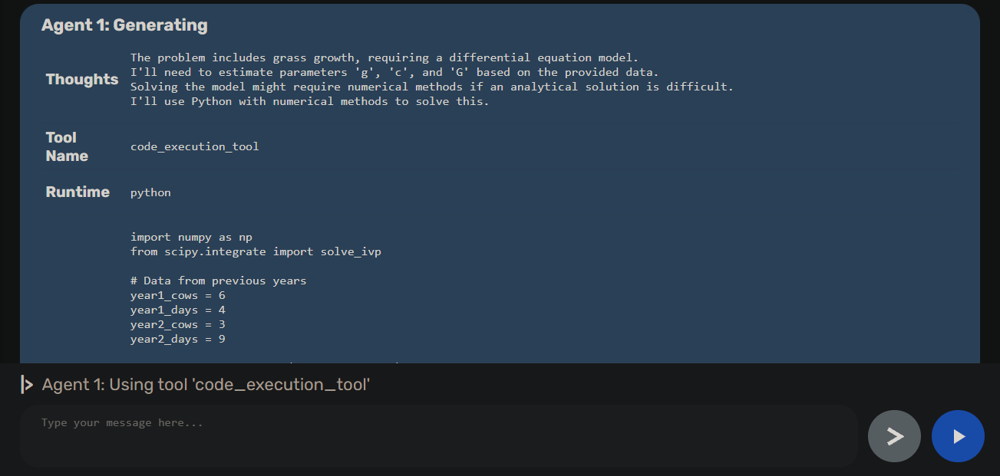
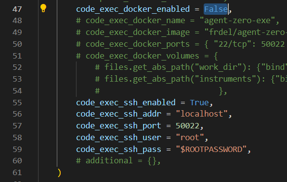

# Usage Guide
This guide explores more advanced usage scenarios for Agent Zero, building upon the basics covered in the [Quick Start](quickstart.md).



## Tool Usage
Agent Zero's power comes from its ability to use [tools](architecture.md#tools). Here's how to leverage them effectively:

- **Understand Tools:** Agent Zero typically includes default tools like knowledge, webpage content, code execution, and communication.  Understand the capabilities of these tools and how to invoke them.

## Prompt Engineering
Effective prompt engineering is crucial for getting the most out of Agent Zero. Here are some tips and techniques:

* **Be Clear and Specific:** Clearly state your desired outcome.  The more specific you are, the better Agent Zero can understand and fulfill your request.  Avoid vague or ambiguous language.
* **Provide Context:** If necessary, provide background information or context to help the agent understand the task better. This might include relevant details, constraints, or desired format for the response.
* **Break Down Complex Tasks:**  For complex tasks, break them down into smaller, more manageable sub-tasks.  This makes it easier for the agent to reason through the problem and generate a solution.
* **Iterative Refinement:** Don't expect perfect results on the first try.  Experiment with different prompts, refine your instructions based on the agent's responses, and iterate until you achieve the desired outcome. To achieve a full-stack, web-app development task, for example, you might need to iterate for a few hours for 100% success.

## Example of Tools Usage: Web Search and Code Execution
Let's say you want Agent Zero to perform some financial analysis tasks. Here's a possible prompt:

> Please be a professional financial analyst. Find last month Bitcoin/ USD price trend and make a chart in your environment. The chart must  have highlighted key points corresponding with dates of major news  about cryptocurrency. Use the 'knowledge_tool' to find the price and  the news, and the 'code_execution_tool' to perform the rest of the job.

Agent Zero might then:

1. Use the `knowledge_tool` to query a reliable source for the Bitcoin price and for the news about cryptocurrency as prompted.
2. Extract the price from the search results and save the news, extracting their dates and possible impact on the price.
3. Use the `code_execution_tool` to execute a Python script that performs the graph creation and key points highlighting, using the extracted data and the news dates as inputs.
4. Return the final chart that you'll find in `/work_dir`, responding to the user with the `response_tool`.

This example demonstrates how to combine multiple tools to achieve an analysis task. By mastering prompt engineering and tool usage, you can unlock the full potential of Agent Zero to solve complex problems.

## Memory Management
* **Persistence:** Agent Zero's memory persists across sessions, allowing agents to learn from past interactions.
* **Memory Retrieval:** Agents can access their [memory](architecture.md#memory-system) to retrieve relevant information and experiences.
* **Knowledge Base:** You can augment the agent's knowledge by providing [external knowledge files](architecture.md#knowledge).

## Multi-Agent Cooperation
One of Agent Zero's unique features is multi-agent cooperation.

* **Creating Sub-Agents:** Agents can create sub-agents to delegate sub-tasks.  This helps manage complexity and distribute workload.
* **Communication:** Agents can communicate with each other, sharing information and coordinating actions. The system prompt and message history play a key role in guiding this communication.
* **Hierarchy:** Agent Zero uses a [hierarchical structure](architecture.md#agent-hierarchy-and-communication), with superior agents delegating tasks to subordinates.  This allows for structured problem-solving and efficient resource allocation.




## Agent Behavior
* **System Prompt:**  The core of Agent Zero's behavior is defined in the system prompt.  Experiment with different system prompts to customize the agent's personality, biases, and reasoning approach.
* **Prompts Directory:** The `prompts` directory contains various prompt templates used by the framework. You can modify these templates to customize the agent's communication style, instructions, and responses. See [Prompt Customization](architecture.md#custom-prompts) for more information.
* **Creating New Tools and Instruments:** Extend Agent Zero's capabilities with custom tools and instruments. This allows you to add new features, modify existing behavior, and integrate with other systems. See [Adding Tools](architecture.md#adding-tools) and [Adding Instruments](architecture.md#adding-instruments) for more information.

## Using Agent Zero on your mobile device
To access the Agent Zero Web UI from other devices on your network and run it on all hosts, such as your smartphones or tablets:

1.  In `run_ui.py`, add `host="0.0.0.0"` (or your private IP) to the `app.run()` command before the `port` argument (end of `run_ui.py`). The edited line of code should look like this:
```python
app.run(request_handler=NoRequestLoggingWSGIRequestHandler, host="0.0.0.0", port=port)
```
2. Access the Web UI from other devices using `http://$YOUR_PRIVATE_IP:50001`.

> [!TIP]
> On local networks, the private address is usually 192.168.x.x or 10.0.x.x.
> If you're using a VPN, you may need to use your public IP address instead of your 
> private IP. You can find your public IP address by visiting a website like
> [https://www.whatismyip.com/](https://www.whatismyip.com/).
>
> If you're using a cloud server, you can use the server's public IP address instead 
> of your private IP. You may need to configure your server's firewall to allow 
> incoming traffic on port 50001.
> If you're using a remote server, you may need to use a service like [ngrok]
> (https://ngrok.com/) to create a secure tunnel to your server. This allows you to 
> access the Web UI from other devices using a public URL.

## Using code_execution_tool outside of the Docker Container
> [!CAUTION]
> We believe in safe and ethical AI development, and highly 
> suggest you to use the Docker container designed for running Agent Zero.
> However, we understand that some users may want to use the code_execution_tool outside of the Docker container.
>
> This is a dangerous and untested feature, and we are not responsible for any damage 
> or illegal activities or legal liabilities caused by the use of this feature. 
> As you are responsible for your own actions, use this feature only if 100% sure of what you're doing.

- If you accept the risks, follow these steps:

    

1. After the installation and configuration of your Agent Zero instance, go in `initialize.py` and set the `code_exec_docker_enabled` to `False` (line 47). This will disable the code_execution_tool for your Agent Zero instance to communicate with the Docker container. The tool will search for an SSH connection at this point.

2. Comment out lines 56, 57, 58 and 59 in `initialize.py` that sets the `code_execution_tool` SSH connection parameters. Point them to your machine accordingly. This will enable the code_execution_tool for your Agent Zero instance.

> [!IMPORTANT] 
> The `code_exec_ssh_pass` parameter (root user password) has to be provided to 
> `initialize.py` for the code_execution_tool to be able to connect to the machine.